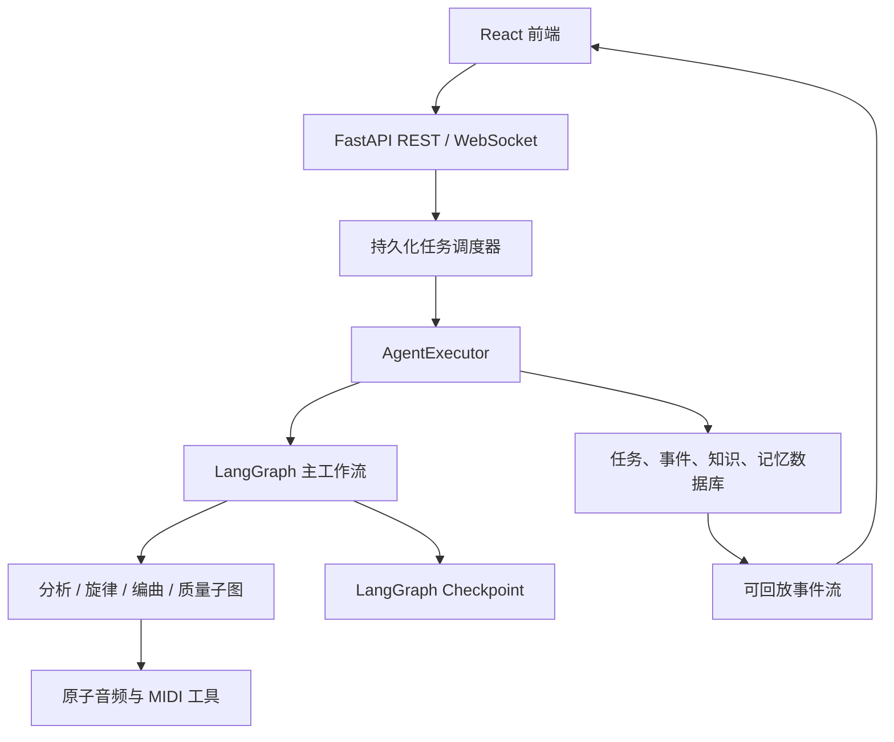

# RingTurn

[](./README.en.md)
[](./README.md)

RingTurn 是一个面向个性化铃声制作的 AI 音乐改编应用。用户上传 MP3/WAV，
输入自然语言需求并设置乐器、速度和时长后，系统通过 LangGraph Agent 完成
音频分析、主旋律提取、MIDI 生成、编曲、渲染和质量检查，并支持反馈重做、
人工介入、重启恢复、实时事件流、RAG 与 Profile 长期记忆。

> 当前实现基线：2026-10。README 说明的是仓库现行代码；历史需求稿和页面
> 设计稿用于追溯早期方案，不代表所有能力均按原设计实现。

## 免责声明

本项目为南京大学智能软件与工程学院本科课程项目，仅供学习使用。

- 用户须确保对上传音频拥有合法使用权。
- 生成内容仅供个人、非商业使用。
- 软件按“原样”提供，不作适销性、特定用途或不侵权保证。
- FFmpeg、FluidSynth、Demucs、Basic Pitch 等第三方组件适用各自许可证。

## 当前能力

- **完整改编流水线**：音源获取 → 结构分析 → 旋律提取 → MIDI → 编曲 →
  渲染 → 质量检查 → 反思。
- **混合 Agent 架构**：主流程采用固定 LangGraph 与条件路由；分析、旋律
  提取、编曲和质量检查使用子图；编曲阶段可选 function calling，并有确定性
  回退路径。
- **旋律质量治理**：人声优先的旋律源选择、多候选评分、音符稳定化、调性/
  八度修正、质量报告和有界返工。
- **可靠执行**：数据库租约、心跳、重复执行防护、启动恢复、LangGraph
  checkpoint、总时限、工具时限、白名单重试和显式降级。
- **实时可观测性**：持久化任务事件、WebSocket 多连接、断线游标回放、执行
  trace、结构化错误和思考过程。
- **反馈与人工介入**：完成后的反馈生成子任务；执行中的人工问题可暂停任务，
  回答后从指定节点恢复同一任务。
- **RAG 与长期记忆**：持久化全局/Profile 知识库、混合检索、反馈和成功任务
  自动学习、相关记忆召回、去重与容量治理。
- **产品功能**：Profile、偏好、工具链配置、历史会话、中英文界面和结果下载。

## 架构概览



主工作流：

```text
entry_router
  → fetch_source
  → analyze_structure
  → extract_melody
  → generate_midi
  → arrange
  → render
  → check_quality
  → reflect
  → retry_router ──→ END
                   └→ arrange（有界返工）
```

反馈任务和人工介入恢复可通过 `resume_from_node` 从中间节点进入。调度器只允许
持有有效租约的实例执行任务；应用重启后，过期租约对应的未完成任务会重新入队，
并优先从 checkpoint 恢复。

## 快速开始

### 环境要求

| 工具 | 建议版本 | 用途 |
|---|---|---|
| Node.js | ≥ 18.18 | 前端构建和开发 |
| Python | 3.10 或 3.11 | 后端及音频模型依赖 |
| FFmpeg | 可用的新版本 | 音频探测和格式转换 |
| FluidSynth | ≥ 2.3 | MIDI 渲染 |
| SoundFont | GM `.sf2` | FluidSynth 音色库 |

Python 3.10 是当前依赖组合最稳妥的选择。缺少 FFmpeg 时仅有有限的 WAV 降级
能力；缺少 FluidSynth 或 SoundFont 时无法完成标准渲染。

### 1. 前端

```bash
cd frontend
npm install
npm run dev
```

访问 `http://localhost:5173/`。Vite 开发服务器会把 API 和 WebSocket 请求代理到
后端。

### 2. 后端

```bash
conda create -n ringturn python=3.10
conda activate ringturn
cd backend
pip install -r requirements.txt
```

准备 SoundFont，示例路径为 `backend/soundfonts/default.sf2`。详细说明见
[SOUNDFONTS.md](./backend/SOUNDFONTS.md)。

在 `backend/.env` 中配置：

```env
LLM_API_KEY=your-api-key
LLM_MODEL=gpt-4
LLM_BASE_URL=

DATABASE_URL=sqlite:///./ringturn.db
CHECKPOINT_DB_URL=sqlite:///./checkpoints.db
FLUIDSYNTH_PATH=fluidsynth
SOUNDFONT_PATH=./soundfonts/default.sf2
FFMPEG_PATH=

AGENT_PIPELINE_TIMEOUT_SECONDS=1800
AGENT_TOOL_TIMEOUT_SECONDS=180
AGENT_TOOL_MAX_ATTEMPTS=2
AGENT_LEASE_SECONDS=120
AGENT_HEARTBEAT_SECONDS=30
AGENT_RECOVER_ON_STARTUP=true

TASK_EVENT_REPLAY_LIMIT=500
TASK_EVENT_POLL_SECONDS=1
TASK_EVENT_HEARTBEAT_SECONDS=15

RAG_TOP_K=4
MEMORY_TOP_K=6
MEMORY_MAX_PER_PROFILE=200
MEMORY_HALF_LIFE_DAYS=90
```

启动：

```bash
cd backend
python -m app.main
# 或
uvicorn app.main:app --reload
```

- API：`http://localhost:8000/api/v1`
- Swagger UI：`http://localhost:8000/docs`
- ReDoc：`http://localhost:8000/redoc`

## 任务状态与实时事件

任务状态为：

```text
pending → planning → executing → completed
                        ├──────→ failed
                        ├──────→ cancelled
                        └──────→ waiting_input → pending
```

`completed`、`failed`、`cancelled` 是终态。取消操作幂等，终态不会被迟到的执行
结果覆盖。

WebSocket 地址：

```text
ws://localhost:8000/ws/chat/{task_id}?after_event_id={cursor}
```

客户端保存最后一个 `event_id`，重连时可以回放遗漏事件。常见事件包括
`status_update`、`thinking_update`、`trace_event`、`waiting_input`、
`completed`、`failed`、`cancelled` 和 `heartbeat`。

## 常用 API

| 方法 | 路径 | 说明 |
|---|---|---|
| POST | `/api/v1/upload` | 上传音频 |
| POST | `/api/v1/tasks` | 创建任务 |
| GET | `/api/v1/tasks/{task_id}/status` | 查询状态和人工介入信息 |
| GET | `/api/v1/tasks/{task_id}/trace` | 查询执行诊断 |
| GET | `/api/v1/tasks/{task_id}/result` | 获取结果 |
| DELETE | `/api/v1/tasks/{task_id}` | 幂等取消任务 |
| POST | `/api/v1/tasks/{task_id}/feedback` | 对完成结果提交反馈 |
| POST | `/api/v1/tasks/{task_id}/interventions` | 暂停并请求人工输入 |
| POST | `/api/v1/tasks/{task_id}/interventions/{id}/response` | 回答并恢复任务 |
| GET/POST | `/api/v1/profiles/{profile_id}/memories` | 管理长期记忆 |
| GET | `/api/v1/knowledge/search` | 检索编曲知识 |
| GET/POST | `/api/v1/knowledge/documents` | 管理知识文档 |

完整协议见 [接口文档](./docs/接口文档.md)。

## 项目结构

```text
ringturn/
├── frontend/                       # React + TypeScript + Vite
│   └── src/
│       ├── api/                    # REST 请求封装
│       ├── components/             # 页面与工具链组件
│       ├── hooks/                  # WebSocket 等 Hooks
│       ├── pages/                  # Home / ChatFlow / Settings
│       ├── types/                  # TypeScript 类型
│       └── utils/websocket.ts      # 游标重连客户端
├── backend/
│   ├── app/
│   │   ├── agent/                  # 主图、子图、节点、工具、trace
│   │   ├── api/v1/                 # REST 与 WebSocket
│   │   ├── models/                 # SQLAlchemy 模型
│   │   ├── schemas/                # Pydantic 协议
│   │   ├── services/               # 调度、事件、LLM、RAG、记忆
│   │   ├── core/                   # 配置与异常
│   │   └── db/                     # 数据库会话
│   ├── evaluation/                 # 旋律基准工具
│   └── tests/                      # 单元和回归测试
└── docs/                            # 当前实现与历史设计文档
```

## 测试

```bash
cd backend
python -m pytest -q
python -m compileall -q app tests
python -m ruff check app tests --select=F821,F822,F823 --ignore=I
```

当前回归基线为 `114 passed, 3 skipped`。跳过项通常依赖本机模型、外部二进制或
可选测试资源。

## 文档导航

- [文档索引](./docs/README.md)
- [Agent 当前实现](./docs/Agent详细设计.md)
- [Agent 可观测性与韧性](./docs/Agent执行可观测性.md)
- [任务调度、重启恢复与人工介入](./docs/Agent运行时连续性.md)
- [RAG 与长期记忆](./docs/RAG与长期记忆.md)
- [完整接口文档](./docs/接口文档.md)
- [Profile 与本地存储](./docs/设计说明文档：Profile模块与本地存储方案.md)
- [工具链配置](./docs/用户工具管理功能设计.md)

## 当前边界

- 任务调度使用主数据库租约与进程内协程，尚未接入独立消息队列或分布式工作
  池；不可抢占的原生计算只能在边界处观察取消。
- RAG 使用本地持久化文档和轻量混合检索，不依赖外部向量数据库或 Embedding
  服务；适合当前小型知识库。
- 音频质量受源文件、模型、SoundFont 和本机工具链影响。当前更适合课程演示和
  简单旋律铃声改编，不应视为专业母带制作系统。
