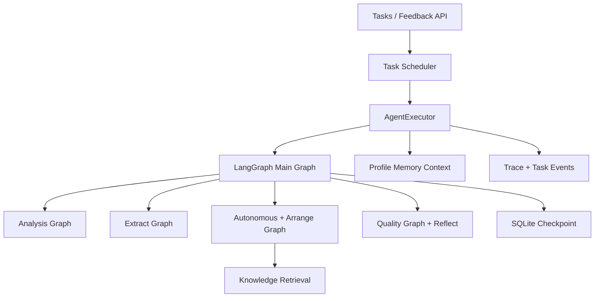

# RingTurn Agent 详细设计

> 实现基线：2026-10。本文描述当前代码，而非早期“每个节点都是 ReAct
> 子 Agent”的设想。执行诊断见 [Agent 执行可观测性](./Agent执行可观测性.md)，
> 调度与恢复见 [Agent 运行时连续性](./Agent运行时连续性.md)，检索与记忆见
> [RAG 与长期记忆](./RAG与长期记忆.md)。

## 1. 定位与架构原则

RingTurn Agent 把用户的自然语言改编需求转换为一条可执行、可诊断、可恢复的
音频处理流程。设计原则如下：

1. **确定性主干**：文件处理和音频产物不完全交给 LLM 自由规划，主流程由
   LangGraph 固定边和条件路由约束。
2. **领域子图**：分析、旋律提取、编曲和质量检查在独立子图内组织，Profile
   可以覆盖部分工具链配置。
3. **有限自主性**：编曲阶段允许 LLM 通过 function calling 自主选择工具，
   但结果缺失、无效或异常时回退到确定性编曲子图。
4. **持久化边界**：任务状态、事件、租约、知识和记忆进入主数据库；LangGraph
   状态进入 checkpoint 数据库；中间文件保存在任务目录。
5. **终态优先**：取消、失败和完成写入均受条件约束，迟到执行结果不能覆盖已
   持久化的终态。
6. **诊断不泄露正文**：trace 记录结构、时长、路由、重试和错误模型，不记录
   提示词、记忆正文、密钥或私有文件路径。

## 2. 组件关系



关键目录：

```text
backend/app/
├── agent/
│   ├── graph.py                 # 主图和入口/重试路由
│   ├── agent_executor.py        # 任务执行、恢复、终态同步
│   ├── state.py                 # AgentState 与 reducer
│   ├── trace.py                 # 事件、错误、清洗和节点包装器
│   ├── resilience.py            # 超时、重试、错误分类
│   ├── nodes/                   # 主节点
│   ├── tool_graphs/             # 分析、提取、编曲、质量子图
│   └── atomic_tools/            # 原子工具
├── services/
│   ├── task_scheduler.py        # 租约、心跳和恢复扫描
│   ├── task_events.py           # 持久化事件和进程内 broker
│   ├── llm_service.py           # LLM、规划、反思和结构化决策
│   ├── knowledge_base.py        # RAG 文档与检索
│   └── memory.py                # 长期记忆与任务上下文
└── api/v1/
    ├── endpoints/tasks.py       # 任务 API 与后台 runner
    ├── endpoints/feedback.py    # 反馈和人工介入
    └── websocket/chat.py        # 事件回放与实时订阅
```

## 3. 主工作流

`agent/graph.py` 构建并缓存一个 `CompiledStateGraph`：

```text
entry_router
  ├─ new_task / invalid target → fetch_source
  └─ feedback_resume           → 指定节点

fetch_source
  → analyze_structure
  → extract_melody
  → generate_midi
  → arrange
  → render
  → check_quality
  → reflect
  → retry_router
       ├─ quality_accepted / retry_limit_reached → END
       └─ quality_revision_requested             → arrange
```

所有主节点通过 `instrument_node` 包装。包装器负责：

- 写入 `running/succeeded/failed/cancelled` trace；
- 计算节点耗时；
- 归一化异常并清洗敏感内容；
- 将节点结果中的字段变化写入摘要，而不是记录完整载荷。

主图使用 `AsyncSqliteSaver`。配置中的 `thread_id` 等于任务 ID，因此恢复、反馈
续跑和诊断使用同一身份。

## 4. AgentState

`AgentState` 是 `TypedDict(total=False)`。主要字段分组：

| 分组 | 关键字段 |
|---|---|
| 身份 | `task_id`、`thread_id`、`profile_id` |
| 输入 | `user_request`、`source_type`、`source_value`、`file_id` |
| 参数 | `instrument`、`tempo`、`duration`、`filename` |
| 规划 | `plan`、`plan_description`、`current_step`、`current_step_index` |
| 音频分析 | `audio_path`、`analysis_result`、Demucs 路径和状态 |
| 旋律 | `melody_data`、旋律/和声源、候选摘要、选中提取器 |
| MIDI/编曲 | `midi_path`、`arrangement_params`、`arranged_midi_path` |
| 结果 | `final_audio_path`、`final_audio_url`、`audio_duration` |
| 质量返工 | `needs_revision`、`reflection`、`correction`、`retry_count`、`max_retries` |
| 恢复 | `resume_from_node`、`human_feedback`、`waiting_for_feedback` |
| 诊断 | `execution_trace`、`execution_error`、`step_results` |

`analysis_result`、`step_results` 等字典使用后写入胜出的 reducer；
`execution_trace` 使用有界、去重、按时间排序的事件 reducer。

## 5. 节点与子图

### 5.1 `fetch_source`

解析上传文件、链接或搜索来源，生成本地 `audio_path`。失败会终止当前图，不会
凭空构造后续产物。

### 5.2 `analyze_structure`

调用 `analysis_graph` 进行元信息、BPM、速度变化、响度、频谱、段落、可选情绪/
效果分析和必要的 Demucs 分离。完成后：

- 把结构化结果写入 `analysis_result`；
- 生成面向用户的分析摘要；
- 调用 `plan_arrangement`，结合用户需求、分析结果、当前参数和 RAG 知识决定
  乐器、速度与可选移调。

用户显式设置的非默认参数优先，LLM 输出经过范围校验。

### 5.3 `extract_melody`

调用 `extract_graph`：

1. 优先选择已分离的人声作为旋律源，原音频/伴奏保留为和声上下文；
2. 运行可用提取器并形成候选；
3. 根据有效音符、覆盖率、碎片率、音高范围等选择候选；
4. 稳定化音符，过滤过短音符，量化并结合调性做修正；
5. 输出 `melody_data`、来源、选中提取器和候选摘要。

子图没有输出时，节点可直接调用 Basic Pitch 作为最后降级路径。降级会写 trace。

### 5.4 `generate_midi`

把旋律音符转换为 MIDI 并进行结构验证。该节点输出 `midi_path`，后续编曲只
消费有效的本地 MIDI。

### 5.5 `arrange`

编曲采用两层策略：

1. `autonomous_arrange_node` 创建 ReAct/function-calling Agent，工具包括知识
   检索、换乐器、变速、移调、量化和回声；
2. 自主结果必须存在且能被 `mido` 解析，否则记录 fallback，并执行
   `arrange_graph` 的确定性工具链。

编曲后可应用 LLM 决策的移调，并仅在旋律长休止区域增加低力度和声。纠正性
重试会先对旋律做调性修正并重建 MIDI。

### 5.6 `render`

使用 FluidSynth 将 MIDI 渲染为音频，按配置和需求进行截取、格式转换并生成
用户可访问的结果 URL。外部二进制调用受执行器管理，取消或停机时会尝试终止。

### 5.7 `check_quality` 与 `reflect`

`quality_graph` 汇总音频和音乐性检查，结果进入 `step_results.quality_check`。
`reflect` 调用 LLM 生成是否返工、原因和建议；LLM 失败时安全降级为“不返工”。

只有 `max_retries > 0` 且反思要求修订时，`retry_router` 才回到 `arrange`。
返工次数达到上限后结束，避免无限循环。

## 6. AgentExecutor 生命周期

`AgentExecutor` 连接数据库任务、LangGraph 状态和用户可见消息：

1. 初始化任务状态和铃声参数；恢复任务时读取持久化中间数据。
2. 设置执行 trace 上下文、Profile 记忆上下文和 Profile ID ContextVar。
3. 新任务进入 `planning` 并由 LLM 生成允许列表内的步骤；崩溃恢复任务可跳过
   重复规划。
4. 进入 `executing`，读取 checkpoint：
   - checkpoint 有待执行节点时，以 `None` 输入继续；
   - 显式反馈/人工回答恢复时，复用 checkpoint 产物，覆盖新参数并从
     `resume_from_node` 进入；
   - checkpoint 已完成但数据库未同步时，从 checkpoint values 修复结果。
5. 成功后写入产物和 `completed`；失败写入结构化错误和 `failed`；用户取消写入
   `cancelled`；运行时停机使用 suspension，不改变持久化任务状态。
6. 最终恢复 ContextVar 并关闭数据库会话。

状态更新使用条件 UPDATE。只允许活跃状态转入下一状态，持久化取消优先于迟到
成功或失败。

## 7. 调度、租约与重启恢复

API 创建任务后调用 `schedule_agent_task`，但进程内调度不是执行所有权。真正
执行前必须通过 `claim_task`：

- `pending` 原子转为 `planning`；
- `planning/executing` 只有租约缺失或过期才能被恢复实例认领；
- 心跳持续延长租约；执行结束释放租约；
- 应用启动扫描 `pending` 和孤儿活跃任务；
- 同进程 `_scheduled_tasks` 只负责减少重复协程，数据库租约负责跨进程去重。

## 8. 反馈与人工介入

两条链路用途不同：

| 场景 | 行为 |
|---|---|
| 对完成/失败结果提交反馈 | 保存 `Feedback`，结构化分析反馈，创建继承产物的子任务，从合适节点重跑 |
| 运行中请求人工输入 | 当前任务进入 `waiting_input`，保存问题并暂停本机执行器 |
| 回答人工问题 | 保存回答和参数，原任务转回 `pending`，从指定节点恢复 |

反馈和人工回答会进入 Profile 长期记忆。人工介入记录有 `open/responded/cancelled`
状态；取消任务会关闭仍开放的介入记录。

## 9. RAG 与长期记忆

执行开始前，系统以当前请求、乐器和速度召回 Profile 相关记忆，构建三层上下文：

1. 用户明确设置的全局偏好；
2. 历史统计画像；
3. 与当前任务相关的长期记忆。

长期记忆明确标注为用户数据而非系统指令。编曲知识检索只能看到全局文档和
当前 Profile 的专属文档。知识正文可注入编曲决策，但不会写入 trace。

## 10. 可观测性与韧性

trace 事件类型包括 `task`、`node`、`tool`、`llm`、`route`、`resilience`、
`control` 和 `memory`。关键边界：

- LLM 请求和工具执行有独立超时；
- 只有白名单中的无副作用分析工具自动重试；
- 自主编曲、旋律提取和伴奏均有显式 fallback 事件；
- pipeline 使用总 deadline，避免每个阶段重新获得完整预算；
- 错误模型包含 scope、component、code、retryable 和清洗后的摘要；
- WebSocket 的 `trace_event` 与诊断 API 均来自持久化数据。

## 11. 数据持久化

| 数据 | 存储 |
|---|---|
| 任务状态、计划、参数、产物、中间摘要 | `tasks` |
| 执行所有权 | `task_execution_leases` |
| 实时事件 | `task_events` |
| LangGraph 状态 | `checkpoints.db` |
| 用户反馈与人工介入 | `feedbacks`、`human_interventions` |
| 知识和长期记忆 | `knowledge_documents`、`long_term_memories` |
| 用户可见思考步骤 | `tasks.thinking_process` |
| 工程 trace 与错误 | `tasks.intermediate_data` 及事件表 |

## 12. 扩展指南

### 新增原子工具

1. 放入正确领域目录并提供明确、可序列化的输入输出。
2. 决定是否有副作用；只有安全幂等工具可进入自动重试白名单。
3. 通过现有 trace 包装器记录结构摘要，不记录参数值或文件内容。
4. 在子图或自主 Agent 工具列表中显式注册。

### 修改子图

1. 更新子图状态定义与主状态映射。
2. 保留 Profile 工具偏好覆盖逻辑。
3. 为分支、降级和产物验证增加测试。
4. 验证旧 checkpoint 缺少新字段时仍能使用默认值。

### 新增主节点

1. 更新 `AgentState` 和 `graph.py`；
2. 更新入口路由允许列表、规划步骤允许列表和恢复节点白名单；
3. 定义取消、失败和重启恢复语义；
4. 补充 trace、任务事件、API 状态和回归测试。
