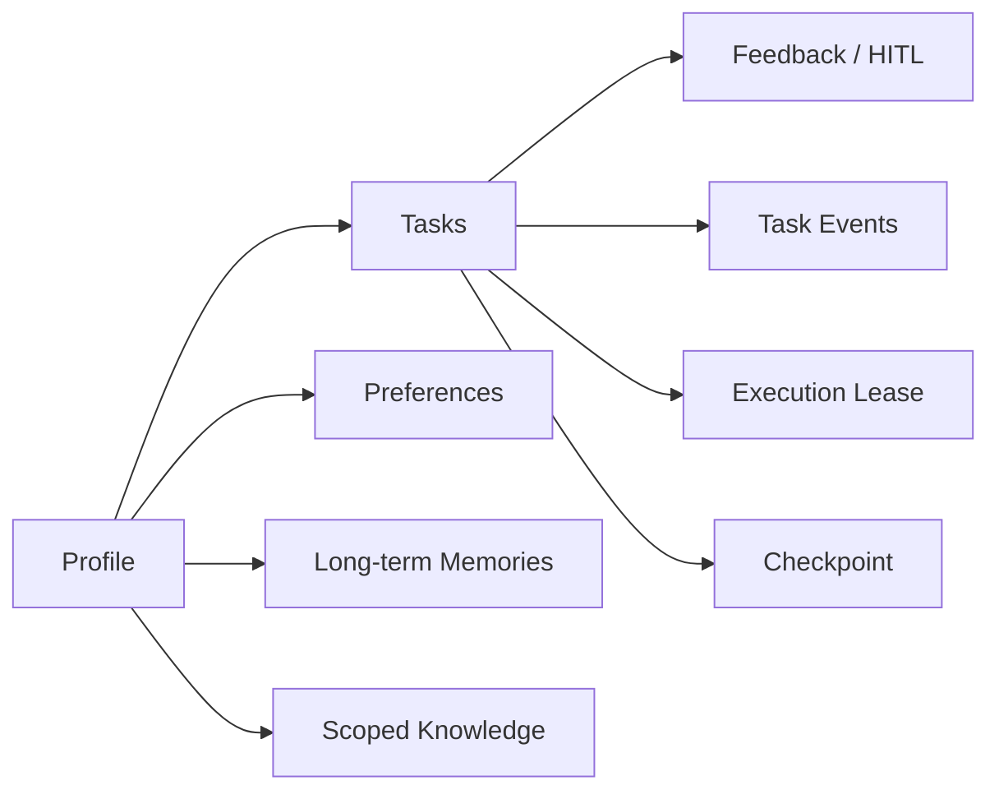

# RingTurn 功能与模块设计

> 本文是当前实现的模块级总览。Agent 内部细节见
> [Agent 详细设计](./Agent详细设计.md)。

## 1. 产品范围

RingTurn 面向本地部署的个人铃声改编场景。用户上传音频，通过自然语言和参数
描述目标，系统输出经过分析、旋律提取、MIDI 编曲、渲染和质量检查的音频。

项目没有传统账户系统。Profile 是本地配置和个性化边界，用于隔离会话、任务、
偏好、工具配置、专属知识和长期记忆。

## 2. 功能模块

### 2.1 输入与会话

- MP3/WAV 上传与元数据返回；
- 新建会话、追加消息、重命名、完成和删除；
- 查询会话当前活跃任务；
- 在同一会话中保留原始任务、反馈和生成版本。

### 2.2 Profile 与个性化

- 创建、切换、编辑、删除 Profile；
- 导入/导出偏好；
- 用户覆盖参数与任务成功后的统计偏好；
- 按子图保存工具配置；
- Profile 专属知识和长期记忆。

### 2.3 Agent 音乐改编

- LLM 理解需求并生成允许列表内的任务计划；
- 音频元数据、节拍、速度变化、响度、频谱、段落和可选语义分析；
- 人声/伴奏分离和旋律源选择；
- 多候选旋律提取、质量评分与稳定化；
- MIDI 生成、乐器变更、变速、移调、量化、长休止和声；
- FluidSynth 渲染、智能截取和格式转换；
- 质量检查、反思与有界返工。

### 2.4 反馈与人工介入

- 对已结束任务提交反馈并创建继承中间产物的优化子任务；
- 在任务执行中持久化人工问题并转为 `waiting_input`；
- 用户回答后更新参数并从指定节点恢复同一任务；
- 反馈和回答自动进入长期记忆。

### 2.5 RAG 与长期记忆

- 持久化内置、全局自定义和 Profile 专属编曲知识；
- 本地 BM25 + 哈希特征相似度混合检索；
- 在编曲决策和自主工具调用前检索相关知识；
- 保存偏好、约束、反馈、指令和历史任务；
- 记忆去重、重要度、置信度、置顶、衰减和容量治理；
- 按当前任务召回，避免把整个历史无差别塞入提示词。

### 2.6 可靠性与可观测性

- 数据库租约、心跳和跨 worker 重复执行防护；
- 应用重启扫描和 LangGraph checkpoint 恢复；
- 幂等取消和终态竞态保护；
- pipeline/tool/LLM 超时、白名单重试和显式降级；
- 结构化 trace、错误模型和用户可见思考过程；
- WebSocket 多连接、事件持久化和断线游标回放。

## 3. 前端模块

| 模块 | 主要职责 |
|---|---|
| `pages/Home.tsx` | 进入应用和基础介绍 |
| `pages/ChatFlow.tsx` | 上传、创建任务、消息流、参数、结果、反馈和人工回答 |
| Settings/Profile 页面 | Profile、偏好和工具链配置 |
| `api/index.ts` | REST 调用封装 |
| `utils/websocket.ts` | 单例连接、事件游标和自动重连 |
| `hooks/useWebSocket.ts` | 把任务事件映射为 React 状态 |
| `types/index.ts` | API 与任务类型 |
| `i18n.ts` | 中英文资源 |

前端优先消费 WebSocket 事件，并保留状态轮询作为降级路径。终态事件停止重连；
`waiting_input` 显示问题并把下一条用户输入发送到介入回答接口。

## 4. 后端模块

| 层 | 目录 | 职责 |
|---|---|---|
| 应用入口 | `app/main.py` | 生命周期、路由、静态文件和恢复启动 |
| API | `app/api/v1/` | REST、WebSocket 和依赖注入 |
| Agent | `app/agent/` | 主图、节点、子图、原子工具、trace 和执行器 |
| 服务 | `app/services/` | 调度、事件、LLM、偏好、文件、RAG 和记忆 |
| 模型 | `app/models/` | SQLAlchemy 表和枚举 |
| 协议 | `app/schemas/` | Pydantic 请求/响应模型 |
| 数据库 | `app/db/` | Engine、Session、建表和 SQLite WAL |

## 5. 数据与存储边界



- `ringturn.db`：产品数据、任务运行态、事件、知识和记忆；
- `checkpoints.db`：LangGraph checkpoint；
- `uploads/`：上传文件；
- `static/ringtones/{task_id}/`：任务中间产物和最终铃声；
- 浏览器 `localStorage`：当前 Profile、语言等前端轻量状态，不作为任务事实来源。

## 6. 关键模块交互

### 创建并执行任务

```text
上传文件
  → 创建会话/任务
  → schedule_agent_task
  → claim_task 取得租约
  → AgentExecutor 注入记忆并运行主图
  → 节点提交状态、思考、trace 和事件
  → WebSocket 推送
  → 完成后更新偏好和历史记忆
```

### 崩溃恢复

```text
进程退出
  → 心跳停止、租约过期
  → 新实例启动扫描
  → 重新认领 planning/executing 任务
  → 读取 checkpoint.next / values
  → 继续图或补齐数据库结果
```

### 人工介入

```text
运行任务
  → 创建 intervention
  → waiting_input + suspend
  → WebSocket 推送问题
  → 用户回答
  → 保存反馈/记忆和新参数
  → pending
  → 调度器从 resume_from_node 恢复
```

## 7. 当前非目标与限制

- 不提供云端用户注册、权限体系或多租户认证；
- 不提供独立消息队列和分布式音频 worker；
- 不保证所有可选研究模型都能在每个平台开箱即用；
- RAG 面向小型本地知识库，不是大规模向量搜索平台；
- 生成质量依赖源音频、模型、SoundFont 和系统二进制环境。
