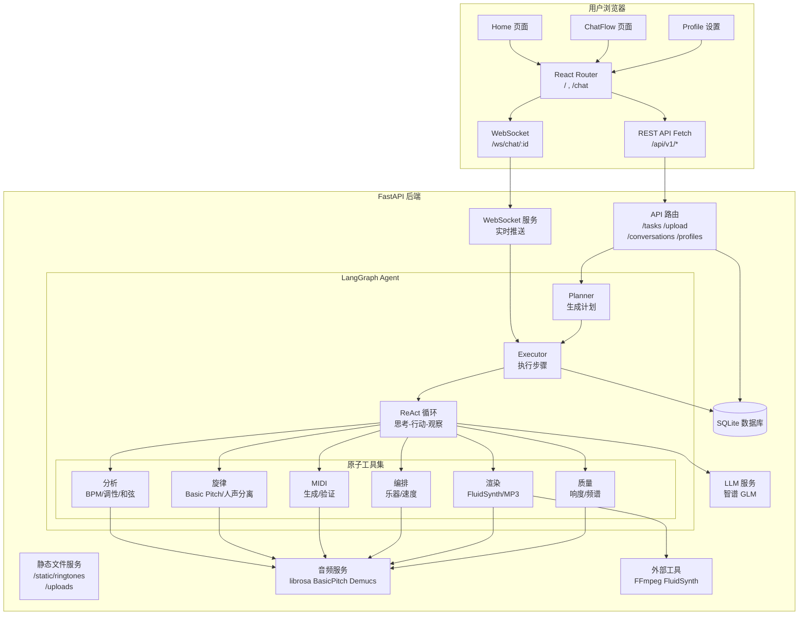
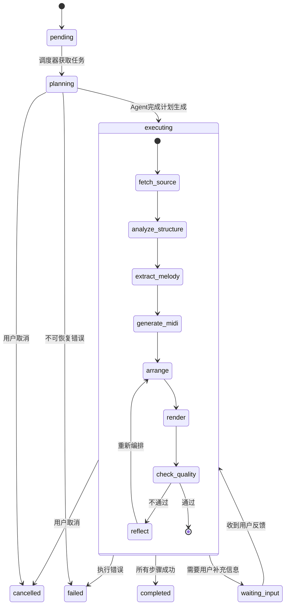
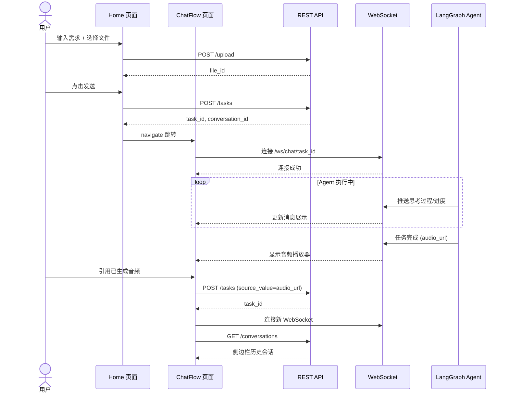
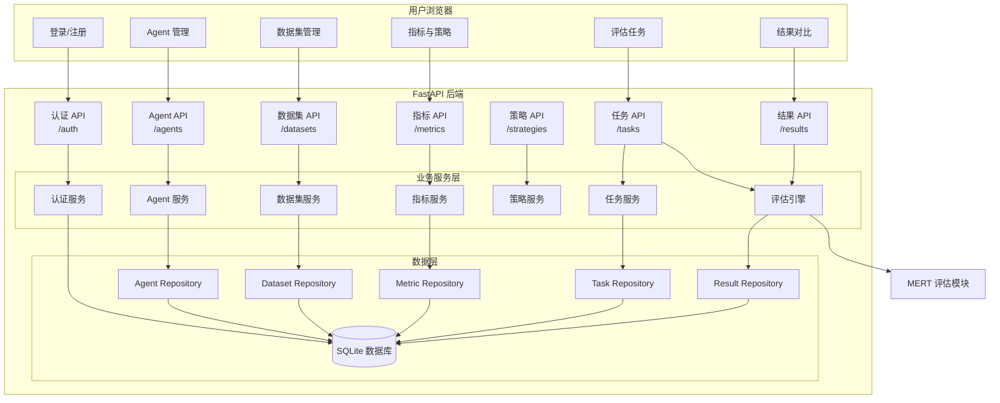

# 详细设计文档

# RingTurn 详细设计文档

## 1. 项目概述

### 1.1 项目背景

RingTurn 是一款基于 AI 的音乐改编应用，允许用户上传音频或引用已生成的音频，通过自然语言描述需求（如"改为钢琴曲"），系统自动完成音乐分析、主旋律提取、MIDI 生成、乐器改编、音频渲染和质量评估，最终生成可下载的铃声文件。

### 1.2 核心功能

| 功能         | 说明                                         |
| :----------- | :------------------------------------------- |
| 音频上传     | 支持 mp3 / wav / flac / m4a / ogg，最大 50MB |
| 自然语言交互 | 用户描述需求，Agent 自动规划并执行           |
| 多轮对话     | 支持引用已生成音频继续优化                   |
| 参数设置     | 乐器、速度 (BPM)、时长、文件名               |
| 实时进度     | WebSocket 推送思考过程和执行状态，降级轮询   |
| 中英文切换   | i18next 国际化                               |
| 历史会话     | 侧边栏展示、查看、删除历史对话               |
| Profile 管理 | 多 Profile 切换，偏好存储                    |
| 工具图可视化 | 查看 LangGraph 工作流                        |

### 1.3 技术栈

| 层级       | 技术                                              |
| :--------- | :------------------------------------------------ |
| 前端框架   | React 18+ + TypeScript                            |
| 构建工具   | Vite 6+                                          |
| 样式       | Tailwind CSS 3                                   |
| 路由       | React Router v7                                  |
| 国际化     | i18next + react-i18next                          |
| HTTP 请求  | Fetch API                                        |
| WebSocket  | 原生 WebSocket (单例模式，支持重连)              |
| 后端框架   | FastAPI + Uvicorn                                |
| Agent 框架 | LangGraph + LangChain                            |
| 推理模式   | ReAct (思考-行动-观察)                           |
| LLM        | 智谱 GLM-4.7-Flash（支持配置自定义模型）        |
| 数据库     | SQLite (WAL 模式)                                |
| 音频处理   | librosa, Basic Pitch, Demucs, FluidSynth         |
| 格式转换   | FFmpeg                                           |

## 2. 系统架构

### 2.1 整体架构



### 2.2 前后端交互

#### 2.2.1 开发环境

| 服务           | 端口 | 说明               |
| :------------- | :--- | :----------------- |
| 前端 (Vite)    | 5173 | 开发服务器，热更新 |
| 后端 (Uvicorn) | 8000 | API + WebSocket    |

前端通过 Vite 代理转发 `/api`、`/ws`、`/static` 请求到后端 8000 端口，避免跨域问题。

#### 2.2.2 请求流程

```
用户操作 → React 组件 → api.xxx() → Fetch → /api/v1/xxx
                                              ↓
浏览器 ← JSON 响应 ← FastAPI 路由 ← 业务逻辑/Agent
```

#### 2.2.3 实时通信

```
任务创建 → useWebSocket(taskId) → ws://localhost:8000/ws/chat/{taskId}
                                         ↓
组件更新 ← onmessage 推送 ← Agent 回调 (思考/进度/完成/失败)
```

WebSocket 连接失败时自动降级为轮询。

### 2.3 Agent 工作流



**状态转换**：

```
pending → planning → executing → completed
                ↓           ↓
            cancelled   waiting_input
                ↓           ↓
              failed     executing (继续)
```

### 2.4 数据流转



### 2.5 关键设计决策

| 决策           | 方案                | 原因                                    |
| :------------- | :------------------ | :-------------------------------------- |
| WebSocket 降级 | 自动切换到轮询      | 网络不稳定时保证可用性                  |
| 本地文件存储   | uploads/ 和 static/ | 用户完全控制数据，无版权风险            |
| ReAct 推理     | 思考-行动-观察循环  | LLM 自主选择和调用工具                  |
| 子图编排       | tool_graphs/        | 分析/编排等复杂节点内部用子图管理工具链 |
| 单例 WebSocket | wsClient 单例       | 避免多连接，全局状态管理                |

## 3. 前端设计

### 3.1 路由设计

| 路径                       | 页面组件             | 说明                                         |
| :------------------------- | :------------------- | :------------------------------------------- |
| `/`                        | `pages/home.tsx`     | 初始页面，输入需求、上传文件、设置参数       |
| `/chat`                    | `pages/ChatFlow.tsx` | 聊天页面，新建会话                          |
| `/chat/c/:conversationId`  | `pages/ChatFlow.tsx` | 聊天页面，加载指定会话历史                   |

路由配置在 `src/App.tsx` 中，使用 `react-router-dom` v7：

```
<Routes>
    <Route path="/" element={<Home />} />
    <Route path="/chat" element={<ChatFlow />} />
    <Route path="/chat/c/:conversationId" element={<ChatFlow />} />
</Routes>
```

页面间通过 `navigate('/chat/c/${conversation_id}', { state })` 传递数据（`taskId`、`userMessage`、`audioFileId`、`filename`、`params`）。

### 3.2 组件树

```
App
├── Home
│   ├── TopBar
│   │   ├── Chat Flow 标题
│   │   ├── New Chat 按钮
│   │   └── Language 下拉切换
│   ├── WelcomeMessage（大标题 + 副标题 + 背景音符图标）
│   └── ChatInputArea (mode="home")
│       ├── 多行输入框
│       ├── 文件上传按钮 + 隐藏 input
│       ├── TrackParams（折叠面板：乐器/速度/时长/文件名）
│       └── 发送按钮
│
└── ChatFlow
    ├── TopBar
    ├── Sidebar
    │   ├── Logo + 收缩按钮
    │   ├── 新建会话按钮
    │   ├── 会话列表（Conversation）← 全部/进行中/已完成 筛选
    │   │   └── 每条：标题 + 最后消息 + 时间 + 状态标签 + 删除按钮
    │   └── 设置/支持（底部，点击打开 SettingsModal / UserManualModal）
    ├── SettingsModal（设置弹窗：基础/档案/偏好/工具 四个标签页）
    ├── UserManualModal（用户手册弹窗，占位）
    ├── 悬浮 Logo 按钮（侧边栏收起时显示，可拖拽）
    ├── 聊天内容区
    │   ├── 会话标题（可选）
    │   ├── WelcomeMessage（空会话时）
    │   └── MessageList
    │       ├── 用户消息气泡
    │       │   └── 文件附件（可选）
    │       └── AI 消息卡片
    │           ├── 深度思考过程（可折叠）
    │           ├── 回复文字
    │           └── 音频文件卡片（播放 + 下载 + 引用）
    ├── ChatInputArea (mode="chat")
    │   ├── 输入框
    │   ├── 文件上传 / TrackParams / 引用状态
    │   └── 发送/取消按钮
    └── WebSocket 连接状态指示器（绿色圆点）
```

### 3.3 核心功能模块

| 模块             | 文件路径                       | 说明                                          |
| :--------------- | :----------------------------- | :-------------------------------------------- |
| API 封装         | `api/index.ts`                 | 任务、上传、下载                              |
| 会话 API         | `api/conversation.ts`          | 会话 CRUD、消息                               |
| Profile API      | `api/profile.ts`               | Profile 管理、偏好                            |
| WebSocket Hook   | `hooks/useWebSocket.ts`        | 连接管理、消息分发、重连、降级                |
| WebSocket 客户端 | `utils/websocket.ts`           | 单例 WebSocket，事件订阅                      |
| 国际化           | `i18n.ts`                      | 中英文语言包                                  |
| 类型定义         | `types/index.ts`               | 全部 TS 接口                                  |
| 工具图工具       | `utils/graphUtils.ts`          | LangGraph JSON 可视化                         |
| Profile 设置     | `components/profile_settings/` | SettingsModal、ProfilePanel、PreferencePanel、ToolPreferencePanel、GraphViewer |
| 用户手册         | `components/UserManualModal.tsx` | 用户手册弹窗（占位）                          |

### 3.4 状态管理

`ChatFlow.tsx` 使用 `useState` 管理以下核心状态：

| 状态变量                             | 类型            | 说明             |
| :----------------------------------- | :-------------- | :--------------- |
| `messages`                           | `Message[]`     | 当前对话消息列表 |
| `currentTaskId`                      | `string | null` | 当前任务 ID      |
| `currentConversationId`              | `string | null` | 当前会话 ID      |
| `isProcessing`                       | `boolean`       | 是否正在执行任务 |
| `audioFileId`                        | `string | null` | 已上传的文件 ID  |
| `referenceAudioUrl`                  | `string | null` | 引用的音频 URL   |
| `sidebarOpen`                        | `boolean`       | 侧边栏展开/收起  |
| `inputValue`                         | `string`        | 输入框内容       |
| `instrument/duration/tempo/filename` | 各 string       | 音频参数         |

### 3.5 类型系统

前端使用 TypeScript 严格类型检查，所有接口定义在 `src/types/index.ts` 中。

**核心接口一览**：

| 分类      | 接口                                                         | 说明                                   |
| :-------- | :----------------------------------------------------------- | :------------------------------------- |
| 通用      | `ApiResponse<T>`                                             | 统一响应格式 `{ code, data, message }` |
| 任务      | `Task`, `TaskStatus`, `TaskListItem`, `TaskStatusInfo`, `TaskResult` | 任务全生命周期                         |
| 请求/响应 | `CreateTaskRequest`, `CreateTaskResponse`                    | 创建任务                               |
| 会话      | `Conversation`, `ConversationListItem`, `ConversationDetail`, `ConversationMessage` | 会话管理                               |
| Profile   | `Profile`, `ProfilePreferences`, `PreferenceResponse`        | 用户偏好                               |
| 上传      | `UploadResult`                                               | 文件上传返回                           |
| 聊天      | `Message`                                                    | 前端消息格式                           |
| 工作流图  | `GraphConfig`                                                | LangGraph 工具图可视化                 |

### 3.6 API 封装

#### 3.6.1 目录结构

```
src/api/
├── index.ts           # 核心 API（任务、上传、下载、会话、Profile）
├── conversation.ts    # 会话专用 API
└── profile.ts         # Profile 专用 API
```

#### 3.6.2 统一请求函数

所有 API 调用基于 `request<T>` 封装，自动拼接 `/api/v1` 前缀，设置 `Content-Type: application/json`，返回统一的 `ApiResponse<T>` 格式。

#### 3.6.3 接口清单

**`api/index.ts`**：

| 方法                    | 端点                                | 说明                                         |
| :---------------------- | :---------------------------------- | :------------------------------------------- |
| `createTask`            | `POST /tasks`                       | 创建任务，返回 `task_id` + `conversation_id` |
| `getTask`               | `GET /tasks/{id}`                   | 任务详情                                     |
| `getTaskStatus`         | `GET /tasks/{id}/status`            | 任务状态（轮询降级）                         |
| `getTaskResult`         | `GET /tasks/{id}/result`            | 生成结果（音频URL）                          |
| `cancelTask`            | `DELETE /tasks/{id}`                | 取消任务                                     |
| `uploadFile`            | `POST /upload`                      | 上传音频（`multipart/form-data`）            |
| `downloadFile`          | —                                   | 浏览器下载文件                               |
| `getConversations`      | `GET /conversations`                | 会话列表                                     |
| `getConversation`       | `GET /conversations/{id}`           | 会话详情                                     |
| `deleteConversation`    | `DELETE /conversations/{id}`        | 删除会话                                     |
| `updateConversation`    | `PATCH /conversations/{id}`         | 更新标题                                     |
| `addMessage`            | `POST /conversations/{id}/messages` | 添加消息                                     |
| `completeConversation`  | `POST /conversations/{id}/complete` | 标记完成                                     |
| `createProfile`         | `POST /profiles`                    | 创建 Profile                                 |
| `getProfiles`           | `GET /profiles`                     | 所有 Profile                                 |
| `getActiveProfile`      | `GET /profiles/active`              | 当前活跃                                     |
| `activateProfile`       | `PUT /profiles/{id}/activate`       | 切换                                         |
| `updateProfile`         | `PUT /profiles/{id}`                | 更新名称                                     |
| `deleteProfile`         | `DELETE /profiles/{id}`             | 删除                                         |
| `getProfileTasks`       | `GET /profiles/{id}/tasks`          | Profile 任务列表                             |
| `getProfilePreferences` | `GET /profiles/{id}/preferences`    | Profile 偏好                                 |
| `createFeedback`        | `POST /tasks/{id}/feedback`         | 提交反馈（优化迭代）                         |

**`api/conversation.ts`** 提供额外封装，支持 `profile_id` 筛选。

### 3.7 WebSocket 实时通信

#### 3.7.1 架构设计

```
ChatFlow 组件
    │
    useWebSocket(taskId)  ← 传入当前任务 ID
    │
    wsClient 单例        ← src/utils/websocket.ts
    │
    WebSocket             ← ws://host/ws/chat/{taskId}
```

#### 3.7.2 wsClient 单例

`WebSocketClient` 类管理连接生命周期：

- **连接**：任务创建后自动连接
- **重连**：断开时最多重试 3 次，间隔递增（5s/10s/15s）
- **停止重连**：任务完成/失败/手动取消时停止
- **事件广播**：`status_update` / `completed` / `failed` / `error` / `connected`

#### 3.7.3 useWebSocket Hook

`useWebSocket(taskId)` 返回：

| 返回值        | 类型                      | 说明           |
| :------------ | :------------------------ | :------------- |
| `isConnected` | `boolean`                 | 连接状态       |
| `taskStatus`  | `TaskStatusInfo | null`   | 最新任务状态   |
| `lastMessage` | `WebSocketMessage | null` | 最后收到的消息 |
| `error`       | `string | null`           | 错误信息       |

#### 3.7.4 降级策略

`ChatFlow.handleSend` 中判断：

```
if (!isConnected || currentTaskId !== res.data.task_id) {
    pollTaskStatus(res.data.task_id, processingMsg.id)  // 降级轮询
}
```

轮询间隔 5 秒，调用 `GET /tasks/{id}/status`，任务完成或失败时停止。

### 3.8 Profile API

**`api/profile.ts`** 提供 Profile 管理接口：

| 方法                   | 端点                                             | 说明               |
| :--------------------- | :----------------------------------------------- | :----------------- |
| `list`                 | `GET /profiles`                                  | 所有 Profile       |
| `getActive`            | `GET /profiles/active`                           | 当前活跃           |
| `get`                  | `GET /profiles/{id}`                             | 详情               |
| `create`               | `POST /profiles`                                 | 创建               |
| `update`               | `PUT /profiles/{id}`                             | 更新名称/偏好      |
| `activate`             | `PUT /profiles/{id}/activate`                    | 切换               |
| `delete`               | `DELETE /profiles/{id}`                          | 删除               |
| `exportPreferences`    | `GET /profiles/{id}/export`                      | 导出偏好           |
| `importPreferences`    | `POST /profiles/{id}/import`                     | 导入偏好           |
| `getPreferences`       | `GET /profiles/{id}/preferences`                 | AI 推荐 + 用户覆盖 |
| `updatePreferences`    | `PUT /profiles/{id}/preferences`                 | 保存覆盖           |
| `resetPreferences`     | `DELETE /profiles/{id}/preferences`              | 恢复 AI 推荐       |
| `getToolPreference`    | `GET /profiles/{id}/tool-preferences/{graph}`    | 工具链配置         |
| `updateToolPreference` | `PUT /profiles/{id}/tool-preferences/{graph}`    | 保存工具配置       |
| `deleteToolPreference` | `DELETE /profiles/{id}/tool-preferences/{graph}` | 恢复默认           |

## 4. 后端设计

### 4.1 目录结构

```
backend/app/
├── main.py                       # FastAPI 应用入口，路由注册，静态文件挂载
├── core/
│   ├── config.py                 # Settings 配置类（环境变量、路径）
│   └── exceptions.py             # 自定义异常（AppException）
├── models/
│   └── __init__.py               # SQLAlchemy 模型（User, Task, Conversation, Message, Profile, Preference, Feedback）
├── schemas/
│   ├── common.py                 # 统一响应格式
│   ├── task.py                   # 任务请求/响应
│   ├── conversation.py           # 会话请求/响应
│   ├── profile.py                # Profile 请求/响应
│   ├── preference.py             # 偏好请求/响应
│   ├── feedback.py               # 反馈请求/响应
│   └── upload.py                 # 上传响应
├── api/v1/
│   ├── __init__.py               # 路由聚合
│   ├── endpoints/
│   │   ├── tasks.py              # 任务 CRUD + Agent 调度
│   │   ├── conversations.py      # 会话 CRUD
│   │   ├── profiles.py           # Profile CRUD + 偏好
│   │   ├── feedback.py           # 反馈提交
│   │   ├── upload.py             # 文件上传
│   │   └── health.py             # 健康检查
│   └── websocket/
│       └── chat.py               # WebSocket 实时推送任务状态
├── agent/
│   ├── state.py                  # AgentState 类型定义
│   ├── graph.py                  # LangGraph 主工作流构建
│   ├── agent_executor.py         # Agent 执行器（plan + execute steps）
│   ├── callbacks.py              # ThinkingCallbackHandler（思考记录回调）
│   ├── node_registry.py          # NODE_HANDLERS 映射
│   ├── thinking_utils.py         # 思考过程记录工具
│   ├── utils.py                  # Agent 工具函数
│   ├── tools.py                  # ToolGateway（工具网关）
│   ├── nodes/
│   │   ├── __init__.py           # 节点导出
│   │   ├── _helpers.py           # 辅助函数
│   │   ├── fetch_source.py       # 获取音频源
│   │   ├── analyze_structure.py  # 分析音乐结构
│   │   ├── extract_melody.py     # 提取主旋律
│   │   ├── generate_midi.py      # 生成 MIDI
│   │   ├── arrange.py            # 乐器改编
│   │   ├── render.py             # 渲染音频
│   │   ├── check_quality.py      # 质量评估
│   │   └── reflect.py            # 反思节点（质量不达标时重试）
│   ├── atomic_tools/             # 原子工具集（LangChain @tool）
│   │   ├── analysis/             # 分析工具（BPM, Key, Chords, Instruments, Spectral, etc.）
│   │   ├── melody/               # 旋律工具（Basic Pitch, Librosa, 人声分离）
│   │   ├── midi/                 # MIDI 工具（生成, 验证, 设置速度）
│   │   ├── arrangement/          # 编排工具（换乐器, 变速, 量化, 移调, 合并轨）
│   │   ├── rendering/            # 渲染工具（FluidSynth, MP3转换, Smart Clip）
│   │   └── quality/              # 质量评估工具（响度, 动态范围, 频谱平衡, 过零率）
│   └── tool_graphs/              # 子图（LangGraph StateGraph）
│       ├── analysis_graph.py     # 分析子图
│       ├── analysis_graph.json   # 分析子图拓扑配置（JSON驱动）
│       ├── arrange_graph.py      # 编排子图
│       ├── arrange_graph.json    # 编排子图拓扑配置（JSON驱动）
│       ├── extract_graph.py      # 提取子图
│       ├── extract_graph.json    # 提取子图拓扑配置（JSON驱动）
│       ├── quality_graph.py      # 质量评估子图
│       ├── base.py               # 子图基类
│       ├── state.py              # 子图状态定义
│       └── nodes/analysis/       # 分析子图内部节点（CLAP, MSAF, 分离决策等）
├── services/
│   ├── llm_service.py            # LLM 调用服务（智谱 GLM）
│   ├── file_service.py           # 文件上传/下载管理
│   ├── audio_converter.py        # 音频格式转换
│   ├── midi_arranger.py          # MIDI 编排服务
│   ├── quality_evaluator.py      # 质量评估服务
│   ├── preference_service.py     # 偏好管理服务
│   └── audio_models/             # 预训练音频模型
│       ├── yamnet_service.py     # YAMNet 音频分类
│       ├── mert_service.py       # MERT 音乐表示
│       └── download_yamnet.py    # 模型下载工具
└── db/
    ├── __init__.py               # 导出 init_db, enable_wal_mode
    └── session.py                # 数据库会话管理（SQLite WAL 模式）
```

### 4.2 核心服务

| 服务          | 文件                                      | 功能                                                         |
| :------------ | :---------------------------------------- | :----------------------------------------------------------- |
| **LLM 服务**  | `services/llm_service.py`                 | 封装智谱 API（`chat/completions`），提供 `generate_plan`、`chat`、`get_llm` 方法，支持限流重试 |
| **文件服务**  | `services/file_service.py`                | 上传路径生成、UUID 文件名、文件存在性验证                    |
| **音频转换**  | `services/audio_converter.py`             | WAV ↔ MP3 互转（FFmpeg）                                     |
| **MIDI 编排** | `services/midi_arranger.py`               | 乐器更换、速度调整、量化、移调、轨道合并                     |
| **质量评估**  | `services/quality_evaluator.py`           | librosa 分析 + UTMOS 模型评分                                |
| **偏好服务**  | `services/preference_service.py`          | Profile 偏好存取、AI 推荐 vs 用户覆盖合并                    |
| **YAMNet**    | `services/audio_models/yamnet_service.py` | 音频事件分类（乐器识别）                                     |
| **MERT**      | `services/audio_models/mert_service.py`   | 音乐表示学习（情感/风格分析）                                |

### 4.3 Agent 工作流

#### 4.3.1 主工作流（`agent/graph.py`）

使用 LangGraph `StateGraph` 构建，采用固定边顺序执行 + 条件路由的混合模式：

```
entry_router（根据 resume_from_node 路由）
  → fetch_source → analyze_structure → extract_melody
  → generate_midi → arrange → render → check_quality
  → reflect
      ├── needs_revision 且未超重试次数 → arrange（重试）
      └── 否则 → END
```

- `entry_router`：根据 `resume_from_node` 决定起始节点（支持反馈任务从中间节点恢复）
- 节点间为固定边，保证执行顺序确定性
- `reflect` 节点通过条件边决定是否重试编排→渲染→质检循环
- 节点函数注册在 `agent/node_registry.py` 的 `NODE_REGISTRY` 字典中

#### 4.3.2 Agent 执行器（`agent/agent_executor.py`）

`AgentExecutor` 类封装完整执行流程：

1. **`_plan()`**：调用 LLM 生成展示性执行计划和自然语言改编思路；计划不改变主图拓扑。
2. **`execute()`**：以 `task_id` 作为 checkpoint `thread_id`，调用已编译的 LangGraph 主图。
3. **统一节点包装器**：记录节点开始、结束、耗时、更新字段和结构化错误，不侵入音频算法。
4. **结果同步**：合并 checkpoint 节点事件与工具事件，将中间产物和诊断写入 `Task.intermediate_data`。
5. **`thinking_process`** 继续服务前端展示；`execution_trace` 独立服务工程诊断。详见 `Agent执行可观测性.md`。

#### 4.3.3 状态管理（`agent/state.py`）

```python
class TaskStep(str, Enum):
    """子步骤枚举"""
    FETCH_SOURCE = "fetch_source"
    ANALYZE_STRUCTURE = "analyze_structure"
    EXTRACT_MELODY = "extract_melody"
    GENERATE_MIDI = "generate_midi"
    ARRANGE = "arrange"
    RENDER = "render"
    CHECK_QUALITY = "check_quality"

class AgentState(TypedDict, total=False):
    # 基础信息
    task_id: str
    user_request: str
    profile_id: int

    # 音频源
    source_type: str
    source_value: str
    file_id: str | None
    audio_path: str | None

    # 铃声参数
    instrument: str
    duration: int
    tempo: int
    filename: str

    # Demucs 分离结果
    demucs_separated: bool
    vocals_path: str | None
    accompaniment_path: str | None
    demucs_stems: str | None

    # 分析结果
    analysis_result: dict | None
    melody_data: dict | None
    midi_path: str | None

    # 旋律提取
    use_vocal_and_accompaniment: bool
    source_for_melody: str | None

    # 改编参数
    arrange_temp_path: str | None
    arrangement_params: dict | None
    arranged_midi_path: str | None

    # 最终输出
    final_audio_path: str | None
    final_audio_url: str | None
    audio_duration: float | None

    # 进度跟踪
    current_step: TaskStep | None
    current_step_index: int
    plan: list[str]
    step_results: dict

    # 反思和反馈
    feedback_history: list[dict]
    reflection: str | None
    needs_revision: bool
    user_approve_retry: bool
    max_retries: int

    # 错误处理
    error: str | None
    retry_count: int

    # 元数据
    created_at: datetime
    updated_at: datetime

    # LangGraph 交互
    thread_id: str
    human_feedback: str | None
    waiting_for_feedback: bool
    resume_from_node: str | None
```

#### 4.3.4 思考记录（`agent/callbacks.py`）

`ThinkingCallbackHandler` 继承 LangChain `BaseCallbackHandler`，在 LLM 推理开始时、结束时、工具调用时记录思考过程，通过 WebSocket 实时推送到前端。

### 4.4 原子工具集

所有工具使用 LangChain `@tool` 装饰器定义，分类存储在 `atomic_tools/` 下：

**分析工具（`analysis/`）**：`get_bpm_tool`, `get_key_tool`, `extract_chord_progression_tool`, `detect_instruments_tool`, `get_spectral_centroid_tool`, `get_rms_energy_tool`, `get_loudness_tool`, `extract_sections_tool`, `detect_special_effects_tool`, `infer_mood_style_tool`, `extract_metadata_tool`

**旋律工具（`melody/`）**：`extract_melody_basic_pitch_tool`, `extract_melody_librosa_tool`, `separate_vocals_tool`, `filter_short_notes_tool`, `quantize_notes_tool`

**MIDI 工具（`midi/`）**：`create_midi_from_notes_tool`, `validate_midi_file_tool`, `set_midi_tempo_tool`

**编排工具（`arrangement/`）**：`change_instrument_tool`, `change_tempo_tool`, `quantize_midi_tool`, `transpose_pitch_tool`, `merge_tracks_tool`, `copy_track_tool`, `add_delay_echo_tool`, `set_portamento_tool`

**渲染工具（`rendering/`）**：`render_midi_with_fluidsynth_tool`, `convert_wav_to_mp3_tool`, `smart_clip_audio_tool`

**质量工具（`quality/`）**：`evaluate_overall_quality_tool`, `loudness_check_tool`, `dynamic_range_tool`, `spectral_balance_tool`, `zero_crossing_rate_tool`

### 4.5 子图设计

复杂节点（`analyze_structure`、`extract_melody`、`arrange`、`check_quality`）内部使用 LangGraph `StateGraph` 子图编排工具链，替代简单的 LLM 线性调用。

**分析子图（`analysis_graph.py`）**：

```
入口 → 元数据提取 → CLAP分类 → 人声检测 → 分离决策
  → (Demucs/Spleeter/Open-Unmix) → 响度分析 → MSAF分段
  → 调性/速度/和弦 → 合并 → 出口
```

**编排子图（`arrange_graph.py`）**：根据用户偏好选择乐器、调整参数。

**提取子图（`extract_graph.py`）**：

```
prepare_source（双轨/单轨决策）→ basic_pitch（Basic Pitch 提取）
  → check_result（结果验证）
      ├── 有音符 → filter_short（过滤短音符）→ quantize（量化）→ ensure_midi
      └── 空结果 → librosa_fallback（降级 Librosa）→ filter_short → quantize → ensure_midi
```

- `prepare_source`：根据 Demucs 分离结果与目标时长，决策使用双轨（人声+伴奏）还是单轨提取
- `basic_pitch`：调用 Spotify Basic Pitch 提取旋律音符，支持双轨分别提取后合并
- `check_result`：验证 Basic Pitch 结果有效性，空则路由至 librosa 降级
- `librosa_fallback`：使用 librosa.pyin 作为降级方案（双轨模式下降级为仅提取人声）
- `filter_short`：过滤时长 < 0.05s 的杂音
- `quantize`：将音符对齐到 16 分音符网格（需 BPM 信息，默认 120）
- `ensure_midi`：确保 melody_data 中包含有效的 midi_path

**质量子图（`quality_graph.py`）**：多维度评估 → 综合评分。

**渲染节点（`render.py`）**：渲染节点不使用子图，而是按固定 4 步顺序执行：

```
MIDI → FluidSynth 渲染 WAV → FFmpeg 转 MP3 → smart_clip 智能截取 → FFmpeg 响度归一化
```

- 步骤1：`render_midi_with_fluidsynth` 将 MIDI + SoundFont 渲染为临时 WAV（44100Hz，不限时长）
- 步骤2：`convert_wav_to_mp3` 将 WAV 转为 MP3（FFmpeg libmp3lame）
- 步骤3：`smart_clip_audio` 以 `mode="auto"` 智能截取到目标时长——在音频 25%~75% 区间找 RMS 能量峰值，对称截取
- 步骤4：FFmpeg `loudnorm` 滤镜（EBU R128，目标 -16 LUFS，峰值 -1.5 dBFS）做响度归一化，失败不影响结果

## 5. API 接口

### 5.1 基础信息

- **Base URL**: `http://localhost:8000/api/v1`
- **WebSocket URL**: `ws://localhost:8000/ws/chat/{task_id}`
- **统一响应格式**:

```json
{
  "code": 200,
  "data": {},
  "message": null
}
```

- **状态码**: `200` 成功，`400` 失败，`401` 异常，`404` 不存在

### 5.2 上传 (Upload)

| 方法 | 路径      | 说明         |
| :--- | :-------- | :----------- |
| POST | `/upload` | 上传音频文件 |

**请求**: `multipart/form-data`

| 参数       | 类型   | 必填 | 说明                                          |
| :--------- | :----- | :--- | :-------------------------------------------- |
| `file`     | File   | 是   | 音频文件 (mp3/wav/flac/m4a/ogg)，最大 50MB    |
| `metadata` | String | 否   | JSON 字符串 `{"title":"...", "artist":"..."}` |

**响应**:

```json
{
  "code": 200,
  "data": {
    "file_id": "uuid",
    "filename": "audio.mp3",
    "file_size": 3.45,
    "format": "mp3",
    "duration": 180.5,
    "created_at": "2025-04-15T10:00:00Z"
  },
  "message": "文件上传成功"
}
```

### 5.3 任务 (Tasks)

| 方法   | 路径                        | 说明                 |
| :----- | :-------------------------- | :------------------- |
| POST   | `/tasks`                    | 创建任务             |
| GET    | `/tasks/{task_id}`          | 任务详情             |
| GET    | `/tasks/{task_id}/status`   | 任务状态（轮询降级） |
| GET    | `/tasks/{task_id}/result`   | 生成结果             |
| DELETE | `/tasks/{task_id}`          | 取消任务             |
| POST   | `/tasks/{task_id}/feedback` | 提交反馈（优化迭代） |

**创建任务请求** (`TaskCreate`):

```json
{
  "user_request": "改为钢琴曲",
  "source_type": "upload",
  "source_value": "file-id-uuid 或 /static/ringtones/xxx.mp3",
  "conversation_id": "conv-uuid (可选)",
  "params": {
    "instrument": "Acoustic Piano",
    "duration": 120,
    "tempo": 120,
    "filename": "Untitled_Track"
  }
}
```

| 参数              | 类型   | 必填 | 说明                                                         |
| :---------------- | :----- | :--- | :----------------------------------------------------------- |
| `user_request`    | string | 是   | 用户自然语言需求                                             |
| `source_type`     | string | 否   | `"upload"` 或 `"search"`，默认 `"upload"`                   |
| `source_value`    | string | 否   | 上传的 `file_id` 或引用的音频路径 `/static/ringtones/xxx.mp3` |
| `conversation_id` | string | 否   | 关联会话 ID                                                  |
| `params`          | object | 否   | `instrument`, `duration`, `tempo`, `filename`                |

**创建任务响应** (`TaskCreateResponse`):

```json
{
  "code": 200,
  "data": {
    "task_id": "uuid",
    "conversation_id": "conv-uuid",
    "status": "pending",
    "created_at": "2025-04-15T10:00:00Z"
  },
  "message": "任务创建成功"
}
```

**任务详情响应** (`TaskDetailResponse`):

```json
{
  "code": 200,
  "data": {
    "task_id": "uuid",
    "user_request": "改为钢琴曲",
    "status": "executing",
    "source_type": "upload",
    "source_value": "file-id-uuid",
    "final_audio_url": "/static/ringtones/uuid/Untitled_Track.mp3",
    "audio_duration": 99.26,
    "plan": ["fetch_source", "analyze_structure", "extract_melody", ...],
    "created_at": "2025-04-15T10:00:00Z",
    "updated_at": "2025-04-15T10:05:00Z"
  },
  "message": "获取任务详情成功"
}
```

**任务状态响应** (`TaskStatusResponse`):

```json
{
  "code": 200,
  "data": {
    "task_id": "uuid",
    "status": "executing",
    "current_subtask": "extract_melody",
    "subtask_progress": 60,
    "message": "正在提取主旋律...",
    "thinking_process": [
      { "step": "extract_melody", "content": "调用工具: separate_vocals...", "timestamp": "..." }
    ]
  },
  "message": "获取任务状态成功"
}
```

> `subtask_progress` 为 0-100 整数，由后端 `Integer` 字段存储。

**任务结果响应** (`TaskResultResponse`):

```json
{
  "code": 200,
  "data": {
    "audio_url": "/static/ringtones/uuid/Untitled_Track.mp3",
    "duration": 99.26,
    "format": "mp3"
  },
  "message": "获取任务结果成功"
}
```

> 任务未完成时 `data` 为 `null`，`code` 仍为 `200`。

**取消任务响应**:

```json
{
  "code": 200,
  "data": {
    "task_id": "uuid",
    "previous_status": "executing",
    "current_status": "cancelled"
  },
  "message": "任务已取消"
}
```

### 5.4 会话 (Conversations)

| 方法   | 路径                           | 说明                     |
| :----- | :----------------------------- | :----------------------- |
| GET    | `/conversations`               | 会话列表                 |
| GET    | `/conversations/{id}`          | 会话详情                 |
| DELETE | `/conversations/{id}`          | 删除会话（级联删除消息） |
| PATCH  | `/conversations/{id}`          | 更新标题                 |
| POST   | `/conversations/{id}/messages` | 添加消息                 |
| POST   | `/conversations/{id}/complete` | 标记完成                 |

**会话列表请求**: `GET /conversations?page=1&page_size=20&status=active&profile_id=1`

| 参数         | 类型   | 必填 | 说明                        |
| :----------- | :----- | :--- | :-------------------------- |
| `page`       | int    | 否   | 页码，默认 1                |
| `page_size`  | int    | 否   | 每页数量，默认 20           |
| `status`     | string | 否   | `"active"` 或 `"completed"` |
| `profile_id` | int    | 否   | 按 Profile 筛选             |

**会话列表响应**:

```json
{
  "code": 200,
  "data": {
    "total": 50,
    "page": 1,
    "page_size": 20,
    "conversations": [
      {
        "conversation_id": "uuid",
        "title": "钢琴风格铃声制作",
        "status": "active",
        "message_count": 5,
        "last_message": "这是Agent的最后回复内容...",
        "created_at": "2025-04-15T10:00:00Z",
        "updated_at": "2025-04-15T10:30:00Z"
      }
    ]
  },
  "message": "获取成功"
}
```

**会话详情响应**:

```json
{
  "code": 200,
  "data": {
    "conversation_id": "uuid",
    "title": "钢琴风格铃声制作",
    "status": "active",
    "messages": [
      { "id": 1, "role": "user", "content": "...", "task_id": null, "created_at": "..." },
      { "id": 2, "role": "assistant", "content": "...", "task_id": "task-uuid", "created_at": "..." }
    ],
    "created_at": "2025-04-15T10:00:00Z",
    "updated_at": "2025-04-15T10:30:00Z"
  },
  "message": "获取成功"
}
```

**更新标题请求**:

```json
{ "title": "新的标题" }
```

**添加消息请求**:

```json
{
  "role": "user",
  "content": "调整一下，让它更柔和一些",
  "task_id": "task-uuid (可选)"
}
```

### 5.5 Profile

| 方法   | 路径                                      | 说明                  |
| :----- | :---------------------------------------- | :-------------------- |
| POST   | `/profiles`                               | 创建 Profile          |
| GET    | `/profiles`                               | 所有 Profile          |
| GET    | `/profiles/active`                        | 当前活跃              |
| PUT    | `/profiles/{id}/activate`                 | 切换活跃              |
| PUT    | `/profiles/{id}`                          | 更新名称              |
| DELETE | `/profiles/{id}`                          | 删除（级联任务+偏好） |
| GET    | `/profiles/{id}/tasks`                    | Profile 任务列表      |
| GET    | `/profiles/{id}/preferences`              | Profile 偏好          |
| GET    | `/profiles/{id}/export`                   | 导出偏好配置          |
| POST   | `/profiles/{id}/import`                   | 导入偏好配置          |
| PUT    | `/profiles/{id}/preferences`              | 保存用户覆盖          |
| DELETE | `/profiles/{id}/preferences`              | 恢复 AI 推荐          |
| GET    | `/profiles/{id}/tool-preferences/{graph}` | 获取工具链配置        |
| PUT    | `/profiles/{id}/tool-preferences/{graph}` | 保存工具链配置        |
| DELETE | `/profiles/{id}/tool-preferences/{graph}` | 恢复默认工具链        |

**创建 Profile**:

```json
{ "name": "我的钢琴偏好" }
```

**切换 Profile**:

```
PUT /profiles/2/activate
```

**偏好响应**:

```json
{
  "code": 200,
  "data": {
    "ai_recommendation": {
      "instrument": "piano",
      "tempo": 120,
      "duration": 30,
      "style_tags": ["classical"]
    },
    "user_overrides": {
      "use_ai_preferences": true,
      "instrument": null,
      "tempo": null,
      "duration": null,
      "style_tags": []
    },
    "effective": {
      "instrument": "piano",
      "tempo": 120,
      "duration": 30,
      "style_tags": ["classical"]
    }
  },
  "message": "获取偏好成功"
}
```

### 5.6 WebSocket

**连接**: `ws://localhost:8000/ws/chat/{task_id}`

**消息类型**:

| type            | 触发时机      | 数据                                                         |
| :-------------- | :------------ | :----------------------------------------------------------- |
| `status_update` | 步骤执行中    | `task_id`, `status`, `current_subtask`, `subtask_progress`, `thinking_process`, `message` |
| `completed`     | 任务完成      | `task_id`, `audio_url`, `duration`                           |
| `failed`        | 任务失败      | `task_id`, `error`                                           |
| `error`         | 连接/系统错误 | `message`                                                    |

## 6. 数据库设计

### 6.1 表结构概览

```
profiles (1) ────── (N) tasks
profiles (1) ────── (1) preferences
profiles (1) ────── (1) tool_preferences
profiles (1) ────── (N) conversations
tasks (1) ────── (N) feedbacks
tasks (1) ────── (N) conversation_messages
conversations (1) ────── (N) conversation_messages
tasks (N) ────── (N) tasks (parent_task_id 自引用)
```

### 6.2 表详细设计

#### 6.2.1 profiles（Profile 表）

| 字段               | 类型        | 约束          | 说明                             |
| :----------------- | :---------- | :------------ | :------------------------------- |
| `id`               | INTEGER     | PK, AUTO      | 主键                             |
| `name`             | VARCHAR(64) | NOT NULL      | Profile 名称                     |
| `is_active`        | INTEGER     | DEFAULT 0     | 0=非活跃, 1=活跃（全局唯一活跃） |
| `preferences_data` | TEXT        | NULL          | 偏好配置 JSON 字符串             |
| `created_at`       | DATETIME    | DEFAULT UTC   | 创建时间                         |
| `updated_at`       | DATETIME    | ON UPDATE UTC | 更新时间                         |

#### 6.2.2 tasks（任务表）

| 字段                 | 类型         | 约束                 | 说明                                                |
| :------------------- | :----------- | :------------------- | :-------------------------------------------------- |
| `id`                 | VARCHAR(36)  | PK                   | UUID                                                |
| `profile_id`         | INTEGER      | FK→profiles.id, NULL | 关联 Profile                                        |
| `parent_task_id`     | VARCHAR(36)  | FK→tasks.id, NULL    | 父任务（优化迭代）                                  |
| `user_request`       | TEXT         | NOT NULL             | 用户自然语言需求                                    |
| `source_type`        | VARCHAR(20)  | DEFAULT 'upload'     | 'upload' / 'search'                      |
| `source_value`       | VARCHAR(255) | —                    | 文件 ID 或引用路径                                  |
| `ringtone_params`    | JSON         | NULL                 | `{instrument, duration, tempo, filename}`           |
| `status`             | ENUM         | NOT NULL             | TaskStatus (pending→...→completed/failed/cancelled) |
| `current_subtask`    | VARCHAR(30)  | —                    | 当前子步骤名称                                      |
| `subtask_progress`   | INTEGER      | DEFAULT 0            | 子步骤进度 0-100                                    |
| `plan`               | JSON         | —                    | LLM 生成的执行计划（步骤列表）                      |
| `current_plan_index` | INTEGER      | DEFAULT 0            | 当前执行到第几步                                    |
| `thread_id`          | VARCHAR(255) | —                    | LangGraph 线程 ID                                   |
| `conversation_id`    | VARCHAR(36)  | FK→conversations.id  | 关联会话                                           |
| `final_audio_url`    | VARCHAR(500) | —                    | 生成的铃声文件路径                                  |
| `thinking_process`   | JSON         | NULL                 | 思考过程记录 `[{"step":"分析","content":"...","timestamp":"..."}]` |
| `error_message`      | TEXT         | —                    | 错误信息                                          |
| `resume_from_node`   | VARCHAR(50)  | NULL                 | 反馈任务从哪个节点开始（用户反馈重试时使用）       |
| `intermediate_data`  | JSON         | NULL                 | 父任务完成时的中间状态（用于反馈重试）             |

**索引**:

- `profile_id` + `status` 联合索引（查询 Profile 下的任务列表）
- `parent_task_id` 索引（查询子任务）
- `conversation_id` 索引（查询会话下的任务）

#### 6.2.3 feedbacks（反馈表）

| 字段         | 类型        | 约束                  | 说明     |
| :----------- | :---------- | :-------------------- | :------- |
| `id`         | INTEGER     | PK, AUTO              | 主键     |
| `task_id`    | VARCHAR(36) | FK→tasks.id, NOT NULL | 关联任务 |
| `content`    | TEXT        | NOT NULL              | 反馈文本 |
| `created_at` | DATETIME    | DEFAULT UTC           | 创建时间 |

#### 6.2.4 preferences（偏好表）

| 字段             | 类型     | 约束                   | 说明                   |
| :--------------- | :------- | :--------------------- | :--------------------- |
| `id`             | INTEGER  | PK, AUTO               | 主键                   |
| `profile_id`     | INTEGER  | FK→profiles.id, UNIQUE | 关联 Profile（一对一） |
| `stats`          | TEXT     | NOT NULL               | AI 统计 JSON           |
| `user_overrides` | TEXT     | NULL                   | 用户覆盖 JSON          |
| `updated_at`     | DATETIME | ON UPDATE UTC          | 更新时间               |

#### 6.2.5 tool_preferences（工具偏好表）

| 字段                    | 类型     | 约束                   | 说明                   |
| :---------------------- | :------- | :--------------------- | :--------------------- |
| `id`                    | INTEGER  | PK, AUTO               | 主键                   |
| `profile_id`            | INTEGER  | FK→profiles.id, UNIQUE | 关联 Profile（一对一） |
| `analysis_graph_config` | TEXT     | NULL                   | 分析子图配置 JSON      |
| `extract_graph_config`  | TEXT     | NULL                   | 提取子图配置 JSON      |
| `arrange_graph_config`  | TEXT     | NULL                   | 编排子图配置 JSON      |
| `render_graph_config`   | TEXT     | NULL                   | 渲染子图配置 JSON      |
| `quality_graph_config`  | TEXT     | NULL                   | 质量子图配置 JSON      |
| `reflect_graph_config`  | TEXT     | NULL                   | 反思子图配置 JSON      |
| `updated_at`            | DATETIME | ON UPDATE UTC          | 更新时间               |

#### 6.2.6 conversations（会话表）

| 字段         | 类型         | 约束                     | 说明                                  |
| :----------- | :----------- | :----------------------- | :------------------------------------ |
| `id`         | VARCHAR(36)  | PK                       | UUID                                  |
| `profile_id` | INTEGER      | FK→profiles.id, NOT NULL | 关联 Profile                          |
| `title`      | VARCHAR(200) | —                        | 会话标题                              |
| `status`     | ENUM         | NOT NULL                 | ConversationStatus (active/completed) |
| `created_at` | DATETIME     | DEFAULT UTC              | 创建时间                              |
| `updated_at` | DATETIME     | ON UPDATE UTC            | 更新时间                              |

#### 6.2.7 conversation_messages（会话消息表）

| 字段              | 类型        | 约束                         | 说明                         |
| :---------------- | :---------- | :--------------------------- | :--------------------------- |
| `id`              | INTEGER     | PK, AUTO                     | 主键                         |
| `conversation_id` | VARCHAR(36) | FK→conversations.id, CASCADE | 关联会话                     |
| `role`            | ENUM        | NOT NULL                     | MessageRole (user/assistant) |
| `content`         | TEXT        | NOT NULL                     | 消息内容                     |
| `task_id`         | VARCHAR(36) | FK→tasks.id, NULL            | 关联任务（可选）             |
| `created_at`      | DATETIME    | DEFAULT UTC                  | 创建时间                     |

**索引**:

- `conversation_id` + `created_at` 联合索引（消息时间排序）

### 6.3 任务状态机

```
pending → planning → executing → completed
            ↓                       ↓
         cancelled              waiting_input
            ↓                       ↓
          failed              executing (继续)
```

| 当前状态      | 触发事件           | 下一状态      |
| :------------ | :----------------- | :------------ |
| pending       | 调度器获取任务     | planning      |
| planning      | Agent 完成计划生成 | executing     |
| planning      | 用户取消           | cancelled     |
| planning      | 不可恢复错误       | failed        |
| executing     | 所有步骤执行成功   | completed     |
| executing     | 需要用户补充信息   | waiting_input |
| executing     | 用户取消           | cancelled     |
| executing     | 执行错误           | failed        |
| waiting_input | 收到用户反馈       | executing     |

### 6.4 级联规则

| 父表          | 子表                  | 规则               |
| :------------ | :-------------------- | :----------------- |
| profiles      | tasks                 | CASCADE DELETE     |
| profiles      | preferences           | CASCADE DELETE     |
| profiles      | tool_preferences      | CASCADE DELETE     |
| profiles      | conversations         | CASCADE DELETE     |
| tasks         | feedbacks             | CASCADE DELETE     |
| tasks         | conversation_messages | SET NULL (task_id) |
| conversations | conversation_messages | CASCADE DELETE     |

# Evaluation Platform 详细设计文档

## 1. 项目概述

### 1.1 项目背景

Evaluation Platform（AgentEval）是一个 **AI Agent 评估平台**，用于对多个 AI Agent 进行标准化测试、对比和评分。平台支持上传测试数据集、配置评估指标和策略、创建评估任务，自动调用 Agent 执行并生成评估结果，最终以可视化报表形式展示 Agent 的性能对比。

### 1.2 核心功能

| 功能           | 说明                                                    |
| :------------- | :------------------------------------------------------ |
| **Agent 管理** | 注册、编辑、查看 AI Agent（API 端点 + 参数配置）        |
| **数据集管理** | 上传、查看测试数据集（JSONL 格式）                      |
| **指标与策略** | 自定义评估指标和评估策略（MERT 音频质量、文本相似度等） |
| **评估任务**   | 创建评估任务，指定 Agent + 数据集 + 策略，批量运行      |
| **结果对比**   | 多 Agent 结果可视化对比（图表、雷达图）                 |
| **用户认证**   | JWT 登录/注册，权限控制                                 |

### 1.3 技术栈

| 层级      | 技术                          |
| :-------- | :---------------------------- |
| 前端框架  | React + TypeScript            |
| UI 组件库 | shadcn/ui (Radix UI)          |
| 样式      | Tailwind CSS                  |
| 构建工具  | Vite                          |
| 图表      | Recharts                      |
| 后端框架  | FastAPI                       |
| 数据库    | PostgreSQL (SQLAlchemy 2.0)      |
| 认证      | JWT (python-jose + passlib)   |
| 评估引擎  | MERT (音乐表示学习)、内置指标 |
| 包管理    | Poetry (pyproject.toml)       |

------

## 2. 系统架构

### 2.1 整体架构



### 2.2 前端路由

| 路径                  | 页面              | 说明                     |
| :-------------------- | :---------------- | :----------------------- |
| `/login`              | Login             | 登录页                   |
| `/register`           | Register          | 注册页                   |
| `/`                   | Overview          | 概览仪表盘（认证后首页） |
| `/agents`             | Agents            | Agent 列表               |
| `/agents/new`         | CreateAgent       | 创建 Agent               |
| `/agents/:id`         | AgentDetail       | Agent 详情               |
| `/agents/:id/edit`    | EditAgent         | 编辑 Agent               |
| `/datasets`           | Datasets          | 数据集列表               |
| `/datasets/upload`    | UploadDataset     | 上传数据集               |
| `/datasets/:id`       | DatasetDetail     | 数据集详情               |
| `/tasks`              | Tasks             | 评估任务列表             |
| `/tasks/new`          | CreateTask        | 创建评估任务             |
| `/tasks/:id`          | TaskDetail        | 任务详情 + 结果展示      |
| `/metrics-strategies` | MetricsStrategies | 指标与策略管理           |
| `/metrics/new`        | CreateMetric      | 创建指标                 |
| `/metrics/:id`        | MetricDetail      | 指标详情                 |
| `/strategies/new`     | CreateStrategy    | 创建策略                 |
| `/strategies/:id`     | StrategyDetail    | 策略详情                 |
| `/compare`            | Compare           | 多 Agent 结果对比        |

### 2.3 后端架构

后端采用分层架构：Router → Service → Repository → Model

```
api/v1/routers/     ← FastAPI 路由层（参数校验、响应格式化）
    │
services/           ← 业务逻辑层（调度、验证、转换）
    │
repositories/       ← 数据访问层（CRUD 封装）
    │
models/             ← SQLAlchemy 数据模型
```

### 2.4 评估流程

```
用户创建评估任务
    │
    ▼
选择 Agent + 数据集 + 评估策略
    │
    ▼
TaskService 创建任务记录 (status=pending)
    │
    ▼
EvaluationService 逐条执行：
    1. 从数据集读取测试用例
    2. 调用 Agent API 获取响应
    3. 运行评估指标（MERT / 内置指标）评分
    4. 保存结果到 Result 表
    │
    ▼
任务完成 (status=completed)
    │
    ▼
前端可视化对比（图表、雷达图）
```

## 3. 前端设计

### 3.1 技术选型

| 类别      | 技术                     |
| :-------- | :----------------------- |
| 框架      | React 18 + TypeScript    |
| 构建      | Vite                     |
| 路由      | React Router v7          |
| UI 组件库 | shadcn/ui (Radix UI)     |
| 样式      | Tailwind CSS             |
| 图表      | Recharts                 |
| HTTP 请求 | Fetch API                |
| 认证      | JWT（localStorage 存储） |

### 3.2 路由设计

| 路径                  | 页面              | 说明                     |
| :-------------------- | :---------------- | :----------------------- |
| `/login`              | Login             | 登录页                   |
| `/register`           | Register          | 注册页                   |
| `/`                   | Overview          | 概览仪表盘（认证后首页） |
| `/agents`             | Agents            | Agent 列表               |
| `/agents/new`         | CreateAgent       | 创建 Agent               |
| `/agents/:id`         | AgentDetail       | Agent 详情               |
| `/agents/:id/edit`    | EditAgent         | 编辑 Agent               |
| `/datasets`           | Datasets          | 数据集列表               |
| `/datasets/upload`    | UploadDataset     | 上传数据集               |
| `/datasets/:id`       | DatasetDetail     | 数据集详情               |
| `/tasks`              | Tasks             | 评估任务列表             |
| `/tasks/new`          | CreateTask        | 创建评估任务             |
| `/tasks/:id`          | TaskDetail        | 任务详情 + 结果展示      |
| `/metrics-strategies` | MetricsStrategies | 指标与策略管理           |
| `/metrics/new`        | CreateMetric      | 创建指标                 |
| `/metrics/:id`        | MetricDetail      | 指标详情                 |
| `/strategies/new`     | CreateStrategy    | 创建策略                 |
| `/strategies/:id`     | StrategyDetail    | 策略详情                 |
| `/compare`            | Compare           | 多 Agent 结果对比        |

路由配置在 `src/app/routes.tsx`，使用 `createBrowserRouter` + `Layout` 嵌套布局。

### 3.3 组件树

```
Router
├── Login
├── Register
└── Layout (侧边栏 + 顶栏)
    ├── Overview (仪表盘)
    ├── Agents
    │   ├── AgentDetail
    │   ├── CreateAgent
    │   └── EditAgent
    ├── Datasets
    │   ├── DatasetDetail
    │   └── UploadDataset
    ├── Tasks
    │   ├── CreateTask
    │   └── TaskDetail
    ├── MetricsStrategies
    │   ├── CreateMetric
    │   ├── MetricDetail
    │   ├── CreateStrategy
    │   └── StrategyDetail
    └── Compare
```

### 3.4 服务层（API 封装）

所有 API 服务位于 `src/app/services/`，按模块拆分：

| 文件          | 说明                                       |
| :------------ | :----------------------------------------- |
| `api.ts`      | 通用类型（`ApiResponse<T>`）、响应处理     |
| `auth.ts`     | 登录、注册、Token 管理                     |
| `agent.ts`    | Agent CRUD（列表、详情、创建、编辑、删除） |
| `dataset.ts`  | 数据集上传、列表、详情                     |
| `metric.ts`   | 评估指标 CRUD                              |
| `strategy.ts` | 评估策略 CRUD                              |
| `task.ts`     | 评估任务 CRUD、启动、取消、进度查询        |
| `result.ts`   | 评估结果查询                               |

**统一响应格式**：`{ code: number, message: string, data: T }`，`code === 0` 表示成功。

**Agent API 示例**（`agent.ts`）：

| 方法          | 端点                 | 说明     |
| :------------ | :------------------- | :------- |
| `getAgents`   | `GET /agents`        | 分页列表 |
| `getAgent`    | `GET /agents/:id`    | 详情     |
| `createAgent` | `POST /agents`       | 创建     |
| `updateAgent` | `PUT /agents/:id`    | 更新     |
| `deleteAgent` | `DELETE /agents/:id` | 删除     |

**Task API 示例**（`task.ts`）：

| 方法         | 端点                     | 说明                         |
| :----------- | :----------------------- | :--------------------------- |
| `getTasks`   | `GET /tasks`             | 分页列表（支持 status 筛选） |
| `getTask`    | `GET /tasks/:id`         | 详情                         |
| `createTask` | `POST /tasks`            | 创建（草稿）                 |
| `updateTask` | `PATCH /tasks/:id`       | 更新配置                     |
| `deleteTask` | `DELETE /tasks/:id`      | 删除（仅草稿）               |
| `startTask`  | `POST /tasks/:id/start`  | 启动入队                     |
| `cancelTask` | `POST /tasks/:id/cancel` | 取消运行                     |

**任务状态机**：

```
created → queued → running → succeeded
                   ↓           ↓
               canceled       failed
```

辅助函数：`getTaskStatusLabel`（中文显示）、`isTaskEditable`、`isTaskStartable`、`isTaskCancelable`、`formatDuration`。

### 3.5 认证流程

- 使用 `AuthContext`（`src/app/contexts/AuthContext.tsx`）管理登录态
- Token 存储在 `localStorage`（键名 `agent_eval_user`）
- 路由守卫：`requireAuth` 工具函数（`src/app/utils/requireAuth.ts`）

## 4. 后端设计

### 4.1 目录结构

```
backend/app/
├── main.py                      # FastAPI 入口
├── api/v1/routers/
│   ├── agents.py                # Agent CRUD
│   ├── datasets.py              # 数据集管理
│   ├── metrics.py               # 评估指标
│   ├── strategies.py            # 评估策略
│   ├── tasks.py                 # 评估任务
│   ├── results.py               # 评估结果
│   ├── auth.py                  # 认证（登录/注册）
│   └── users.py                 # 用户管理
├── models/
│   ├── agent.py                 # Agent 模型
│   ├── dataset.py               # 数据集模型
│   ├── metric.py                # 评估指标模型
│   ├── strategy.py              # 策略模型
│   ├── task.py                  # 任务模型
│   ├── result.py                # 结果模型（TaskCaseResult, TaskResultSummary）
│   └── user.py                  # 用户模型
├── schemas/
│   ├── agent.py                 # Agent Pydantic 校验
│   ├── dataset.py               # 数据集校验
│   ├── metric.py                # 指标校验
│   ├── strategy.py              # 策略校验
│   ├── task.py                  # 任务校验
│   ├── result.py                # 结果校验
│   └── user.py                  # 用户校验
├── services/
│   ├── agent_service.py         # Agent 业务逻辑
│   ├── dataset_service.py       # 数据集处理
│   ├── metric_service.py        # 指标管理
│   ├── strategy_service.py      # 策略管理
│   ├── task_service.py          # 任务调度
│   ├── evaluation_service.py    # 评估引擎（核心）
│   ├── result_service.py        # 结果查询
│   ├── builtin_metrics.py       # 内置指标库
│   └── user_service.py          # 用户管理
├── repositories/
│   ├── agent_repo.py            # Agent 数据访问
│   ├── dataset_repo.py          # 数据集数据访问
│   ├── metric_repo.py           # 指标数据访问
│   ├── strategy_repo.py         # 策略数据访问
│   ├── task_repo.py             # 任务数据访问
│   ├── result_repo.py           # 结果数据访问
│   └── user_repo.py             # 用户数据访问
├── mert/
│   ├── api.py                   # MERT 评估接口
│   ├── mert_extractor.py        # MERT 特征提取
│   └── score_api.py             # MERT 评分 API
├── db/
│   └── session.py               # 数据库连接（异步 SQLAlchemy）
└── utils/
    └── response.py              # 统一响应工具
```

### 4.2 架构模式

采用 **分层架构**：Router → Service → Repository → Model

```
api/v1/routers/     ← 路由层：参数校验（Pydantic）、响应格式化
    ↓
services/           ← 业务层：调度、验证、状态转换
    ↓
repositories/       ← 数据层：CRUD 封装、查询构建
    ↓
models/             ← 数据模型（SQLAlchemy ORM）
```

**统一响应格式**（`utils/response.py`）：

**成功响应**：
```json
{ "code": 0, "data": {}, "message": "OK", "request_id": "..." }
```

**失败响应**（全局异常处理器）：
```json
{ "code": 40401, "message": "具体错误信息", "data": null }
```
> 失败时 `code = 状态码 * 100 + 1`，如 404→40401，500→50000

### 4.3 Task 模型（`models/task.py`）

| 字段          | 类型          | 说明                                                     |
| :------------ | :------------ | :------------------------------------------------------- |
| `id`          | String (UUID) | 主键                                                     |
| `name`        | String        | 任务名称                                                 |
| `description` | String?       | 任务描述                                                 |
| `agent_id`    | String?       | 关联 Agent                                               |
| `dataset_id`  | String        | 关联数据集                                               |
| `strategy_id` | String        | 关联评估策略                                             |
| `params`      | JSON?         | 运行参数                                                 |
| `status`      | String        | 状态（created→queued→running→succeeded/failed/canceled） |
| `progress`    | JSON?         | 进度 `{total_cases, processed_cases, ...}`               |
| `error`       | JSON?         | 失败错误信息                                             |
| `created_by`  | String?       | 创建者                                                   |
| `created_at`  | DateTime      | 创建时间                                                 |
| `queued_at`   | DateTime?     | 入队时间                                                 |
| `started_at`  | DateTime?     | 开始执行时间                                             |
| `finished_at` | DateTime?     | 完成时间                                                 |

### 4.4 Task 状态机

```
created → queued → running → succeeded
              ↓         ↓
          canceled   failed
```

| 状态                                | 可执行操作           |
| :---------------------------------- | :------------------- |
| `created`                           | 编辑配置、删除、启动 |
| `queued` / `running`                | 取消                 |
| `succeeded` / `failed` / `canceled` | 查看结果（不可变更） |

### 4.5 Task API（`api/v1/routers/tasks.py`）

| 方法     | 路径                 | 说明                             |
| :------- | :------------------- | :------------------------------- |
| `POST`   | `/tasks`             | 创建任务（草稿，status=created） |
| `GET`    | `/tasks`             | 分页列表（支持 `?status=` 过滤） |
| `GET`    | `/tasks/{id}`        | 任务详情                         |
| `PATCH`  | `/tasks/{id}`        | 更新配置（仅 created 状态）      |
| `DELETE` | `/tasks/{id}`        | 删除（仅 created 状态）          |
| `POST`   | `/tasks/{id}/start`  | 启动任务（后台异步执行）         |
| `POST`   | `/tasks/{id}/cancel` | 取消任务                         |

**启动任务流程**：

```python
@router.post("/{task_id}/start")
def start_task(task_id: str, background_tasks: BackgroundTasks, db):
    task = TaskService.start_task(db, task_id)         # 状态 → queued
    background_tasks.add_task(EvaluationService.run_task, task_id)  # 异步执行
    return task
```

### 4.6 评估引擎（`services/evaluation_service.py`）

**核心类**：

| 类                  | 职责                                           |
| :------------------ | :--------------------------------------------- |
| `MetricEngine`      | 单条指标评估（内置指标/自定义规则/自定义脚本） |
| `StrategyEngine`    | 多指标聚合（加权求和/平均/求和）               |
| `EvaluationService` | 任务执行主流程                                 |

**内置指标**（`builtin_metrics.py`）：`success`、`success_rate`、`exact_match`、`non_empty_output`，以及 MERT 音频质量等扩展指标。

**评估流程**：

```
EvaluationService.run_task(task_id)
  │
  ├─ 1. 加载 Task / Dataset / Strategy / Metrics
  ├─ 2. 遍历数据集的每条 case：
  │    ├─ 调用 Agent API 获取输出（output）
  │    ├─ 与 expected 对比
  │    ├─ MetricEngine.evaluate_metrics() 计算各指标得分
  │    ├─ StrategyEngine.aggregate_case_score() 聚合单项得分
  │    └─ 保存 TaskCaseResult
  ├─ 3. 汇总 TaskResultSummary（overall_score + metric_scores + counts）
  └─ 4. 更新 Task 状态 → succeeded（或 failed）
```

**指标类型**：

| kind            | 说明                                |
| :-------------- | :---------------------------------- |
| `builtin`       | 内置指标（直接计算）                |
| `custom_rule`   | 自定义规则（路径取值 + 运算符比较） |
| `custom_script` | 自定义脚本（Python 沙箱执行）       |

**脚本沙箱限制**：仅暴露安全内置函数（`abs`, `len`, `str`, `float`, `int`, `dict`, `list`, `max`, `min` 等），禁止文件 I/O 和网络访问。

### 4.7 Agent API（`api/v1/routers/agents.py`）

| 方法     | 路径           | 说明       |
| :------- | :------------- | :--------- |
| `POST`   | `/agents`      | 创建 Agent |
| `GET`    | `/agents`      | 分页列表   |
| `GET`    | `/agents/{id}` | 详情       |
| `PUT`    | `/agents/{id}` | 更新       |
| `DELETE` | `/agents/{id}` | 删除       |

**Agent 模型**：

| 字段         | 类型          | 说明                                         |
| :----------- | :------------ | :------------------------------------------- |
| `id`         | String (UUID) | 主键                                         |
| `name`       | String        | Agent 名称                                   |
| `version`    | String?       | 版本标识                                     |
| `config`     | JSON?         | 运行配置（API URL、Key、参数）               |
| `created_by` | String?       | 创建者                                       |

## 5. 数据库设计

### 5.1 表结构概览

```
users ─────────────────────────────────────────────
  │
  ├── agents (created_by)
  ├── tasks (created_by)
  │     ├── task_result_summaries (1:1)
  │     └── task_case_results (1:N)
  │
  ├── datasets
  │     └── dataset_cases (1:N)
  │
  ├── metrics
  └── strategies (metric_items JSON 引用 metrics.id)
```

### 5.2 表详细设计

#### 5.2.1 users（用户表）

| 字段         | 类型          | 约束             | 说明     |
| :----------- | :------------ | :--------------- | :------- |
| `id`         | String (UUID) | PK               | 主键     |
| `username`   | String        | UNIQUE, NOT NULL | 用户名   |
| `created_at` | DateTime      | DEFAULT UTC      | 创建时间 |

#### 5.2.2 agents（Agent 表）

| 字段         | 类型          | 约束             | 说明                              |
| :----------- | :------------ | :--------------- | :------------------------------- |
| `id`         | String (UUID) | PK               | 主键                              |
| `name`       | String        | UNIQUE, NOT NULL | Agent 名称                        |
| `version`    | String        | NULL             | 版本标识                          |
| `config`     | JSON          | NULL             | 运行配置 `{api_url, api_key, model, ...}` |
| `created_by` | String        | NULL             | FK→users.id                       |
| `created_at` | DateTime      | DEFAULT UTC      | 创建时间                          |

#### 5.2.3 datasets（数据集表）

| 字段          | 类型          | 约束             | 说明        |
| :------------ | :------------ | :--------------- | :---------- |
| `id`          | String (UUID) | PK               | 主键        |
| `name`        | String        | UNIQUE, NOT NULL | 数据集名称  |
| `description` | String        | NULL             | 描述        |
| `case_count`  | Integer       | DEFAULT 0        | 用例数量    |
| `created_by`  | String        | NULL             | FK→users.id |
| `created_at`  | DateTime      | DEFAULT UTC      | 创建时间    |

#### 5.2.4 dataset_cases（数据集用例表）

| 字段         | 类型          | 约束                     | 说明                 |
| :----------- | :------------ | :----------------------- | :------------------- |
| `id`         | String (UUID) | PK                       | 主键                 |
| `dataset_id` | String        | FK→datasets.id, NOT NULL | 所属数据集           |
| `case_id`    | String        | NOT NULL                 | 用例标识（外部导入） |
| `input`      | JSON          | NOT NULL                 | 输入数据             |
| `output`     | JSON          | NOT NULL                 | 输出数据             |
| `expected`   | JSON          | NULL                     | 期望结果             |
| `meta`       | JSON          | NULL                     | 元数据               |

**索引**: `(dataset_id, case_id)` 联合唯一索引。

#### 5.2.5 metrics（评估指标表）

| 字段          | 类型          | 约束             | 说明                                              |
| :------------ | :------------ | :--------------- | :------------------------------------------------ |
| `id`          | String (UUID) | PK               | 主键                                              |
| `name`        | String        | UNIQUE, NOT NULL | 指标名称                                          |
| `kind`        | String        | NOT NULL         | 类型：`builtin` / `custom_rule` / `custom_script` |
| `description` | String        | NULL             | 描述                                              |
| `config`      | JSON          | NULL             | 指标配置 `{key, operator, value, ...}`            |
| `created_by`  | String        | NULL             | FK→users.id                                       |
| `created_at`  | DateTime      | DEFAULT UTC      | 创建时间                                          |

#### 5.2.6 strategies（评估策略表）

| 字段           | 类型          | 约束             | 说明                            |
| :------------- | :------------ | :--------------- | :------------------------------ |
| `id`           | String (UUID) | PK               | 主键                            |
| `name`         | String        | UNIQUE, NOT NULL | 策略名称                        |
| `description`  | String        | NULL             | 描述                            |
| `metric_items` | JSON          | NOT NULL         | `[{metric_id, weight, params}]` |
| `created_by`   | String        | NULL             | FK→users.id                     |
| `created_at`   | DateTime      | DEFAULT UTC      | 创建时间                        |

#### 5.2.7 tasks（评估任务表）

| 字段          | 类型          | 约束                        | 说明                                             |
| :------------ | :------------ | :-------------------------- | :----------------------------------------------- |
| `id`          | String (UUID) | PK                          | 主键                                             |
| `name`        | String        | NOT NULL                    | 任务名称                                         |
| `description` | String        | NULL                        | 描述                                             |
| `agent_id`    | String        | NULL                        | FK→agents.id                                     |
| `dataset_id`  | String        | NOT NULL                    | FK→datasets.id                                   |
| `strategy_id` | String        | NOT NULL                    | FK→strategies.id                                 |
| `params`      | JSON          | NULL                        | 运行参数                                         |
| `status`      | String        | NOT NULL, DEFAULT 'created' | created→queued→running→succeeded/failed/canceled |
| `progress`    | JSON          | NULL                        | 进度                                             |
| `error`       | JSON          | NULL                        | 失败信息                                         |
| `created_by`  | String        | NULL                        | FK→users.id                                      |
| `created_at`  | DateTime      | DEFAULT UTC                 | 创建时间                                         |
| `queued_at`   | DateTime      | NULL                        | 入队时间                                         |
| `started_at`  | DateTime      | NULL                        | 开始执行时间                                     |
| `finished_at` | DateTime      | NULL                        | 完成时间                                         |

#### 5.2.8 task_result_summaries（任务结果汇总表）

| 字段            | 类型     | 约束        | 说明                                           |
| :-------------- | :------- | :---------- | :--------------------------------------------- |
| `task_id`       | String   | PK (1:1)    | FK→tasks.id                                    |
| `overall_score` | Float    | NULL        | 总评分（0-1）                                  |
| `metric_scores` | JSON     | NULL        | `[{metric_id, name, score, detail}]`           |
| `counts`        | JSON     | NULL        | `{total_cases, succeeded_cases, failed_cases}` |
| `created_at`    | DateTime | DEFAULT UTC | 创建时间                                       |

#### 5.2.9 task_case_results（单样本评测明细表）

| 字段            | 类型          | 约束            | 说明           |
| :-------------- | :------------ | :-------------- | :------------- |
| `id`            | String (UUID) | PK              | 主键           |
| `task_id`       | String        | INDEX, NOT NULL | FK→tasks.id    |
| `case_id`       | String        | INDEX, NOT NULL | 数据集用例 ID  |
| `input`         | JSON          | NULL            | 样本输入       |
| `expected`      | JSON          | NULL            | 期望输出       |
| `output`        | JSON          | NULL            | Agent 实际输出 |
| `metric_scores` | JSON          | NULL            | 各指标得分     |
| `trace`         | JSON          | NULL            | 执行轨迹       |
| `artifacts`     | JSON          | NULL            | 产物列表       |
| `created_at`    | DateTime      | DEFAULT UTC     | 创建时间       |

### 5.3 任务状态机

```
created → queued → running → succeeded
              ↓         ↓
          canceled   failed
```

| 状态        | 允许操作           |
| :---------- | :----------------- |
| `created`   | 编辑、删除、启动   |
| `queued`    | 取消               |
| `running`   | 取消               |
| `succeeded` | 查看结果           |
| `failed`    | 查看结果、查看错误 |
| `canceled`  | 查看结果           |

### 5.4 级联规则

| 父表     | 子表                  | 规则           |
| :------- | :-------------------- | :------------- |
| datasets | dataset_cases         | CASCADE DELETE |
| tasks    | task_result_summaries | 手动删除       |
| tasks    | task_case_results     | 手动删除       |

## 6. MERT 评估模块

### 6.1 概述

MERT（Music Understanding Model）是评估平台的可选音频质量评估模块，用于评价 AI Agent 生成的音乐与用户文字描述的匹配度。基于 **CLAP**（Contrastive Language-Audio Pretraining）模型，将文本描述和音频映射到同一向量空间，计算余弦相似度作为评分。

### 6.2 服务架构

MERT 模块是**独立的 FastAPI 服务**，与主后端分离运行：

| 服务               | 端口     | 功能                             |
| :----------------- | :------- | :------------------------------- |
| MERT Embedding API | 独立端口 | 音频特征提取（MERT 预训练模型）  |
| MERT Score API     | 独立端口 | 文本-音频相似度评分（CLAP 模型） |

主后端通过 HTTP 调用这两个服务来获取音频质量评分。

### 6.3 核心组件

#### 6.3.1 CLAP 相似度评分（`score_api.py`）

**模型**: `laion/clap-htsat-unfused`（LAION 开源的文本-音频对齐模型）

**原理**: 将文本描述和音频分别编码为向量，计算余弦相似度，映射到 0-1 分数。

**API**: `POST /score`

```json
// 请求
{ "prompt": "一首欢快的钢琴曲", "audio_path": "/path/to/audio.wav" }

// 响应
{ "score": 0.85 }
```

**处理流程**:

```
音频文件 → librosa 加载 (48kHz) → CLAP 音频编码器 → 音频向量
文字描述 → CLAP 文本编码器 → 文本向量
         ↓
    余弦相似度 → 归一化 (0-1) → 返回分数
```

#### 6.3.2 MERT 特征提取（`api.py`）

**功能**: 使用 MERT 预训练模型从音频中提取音乐特征向量，用于更细粒度的音乐分析。

**API**: `POST /embedding`

```json
// 请求（multipart/form-data）
file: audio.wav

// 响应
{ "vector": [0.12, -0.34, ...], "shape": [768] }
```

#### 6.3.3 目录结构

```
backend/app/mert/
├── api.py              # MERT 特征提取服务（独立 FastAPI）
├── mert_extractor.py   # 预训练 MERT 模型加载器
└── score_api.py        # CLAP 相似度评分服务（独立 FastAPI）
```

### 6.4 与评估引擎的集成

在 `builtin_metrics.py` 中注册为内置指标：

```python
def clap_similarity(ctx, config=None):
    """CLAP 文本-音频相似度"""
    prompt = ctx.get("expected", {}).get("text", "")
    audio_path = ctx.get("output", {}).get("audio_path", "")
    response = requests.post(MERT_SCORE_URL + "/score", json={
        "prompt": prompt,
        "audio_path": audio_path
    })
    return response.json()["score"], {"source": "clap"}
```

评估任务运行时，如果策略中包含 CLAP 指标，评估引擎会自动调用 MERT 服务获取评分。
