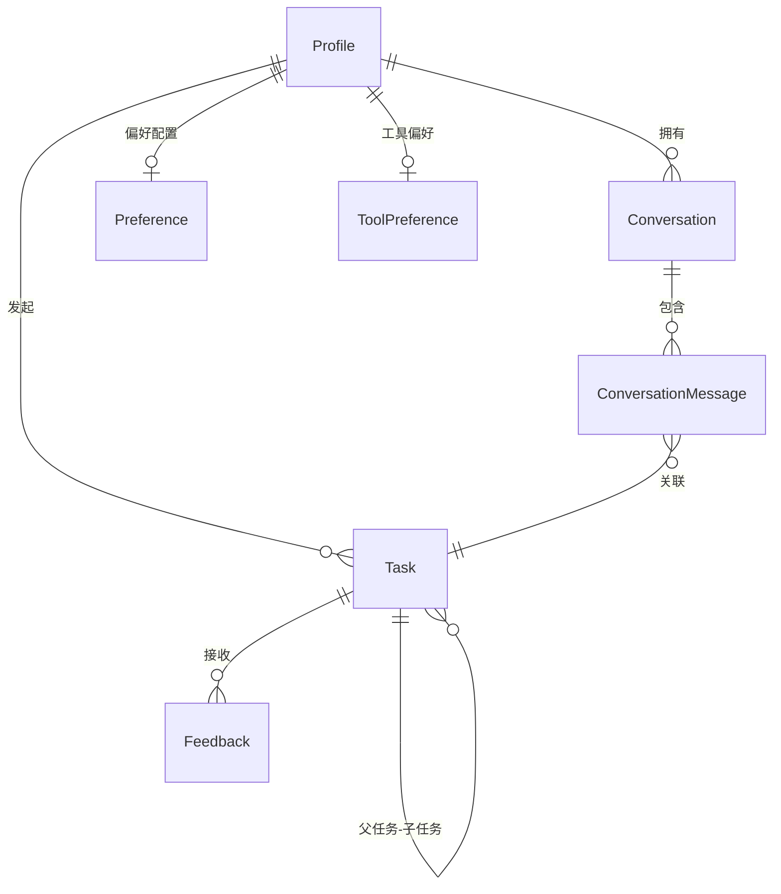
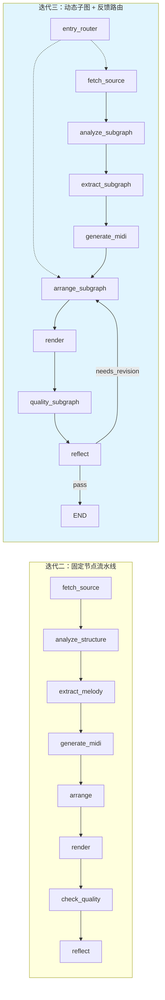

# RingTurn 迭代三需求分析文档

> 版本：v3.0  
> 日期：2026-06-15  
> 项目：南京大学 2026 春季学期《软工三》课程项目 — RingTurn AI 音乐改编 Agent
>
> **文档状态：历史迭代需求。** 用于追溯 v3.0 的计划与验收目标；当前代码在此
> 基础上继续加入了任务租约、重启恢复、可回放事件、人工介入、RAG 和长期记忆。
> 当前实现以 [文档索引](./README.md) 为准。

---

## 1. 迭代背景与目标

### 1.1 迭代背景

迭代二已完成 RingTurn 的核心 Agent 流水线：用户上传音频 → 音乐分析 → 主旋律提取 → MIDI 生成 → 乐器改编 → 智能截取 → 渲染输出 → 质量评估。Agent 具备基础的思考、工具调用与异常应对能力，能够在单次请求中完成"从音频到铃声"的端到端生成。

然而，迭代二的 Agent 仍处于"原型"阶段：
- **交互模式单一**：每次生成都是独立会话，缺少历史对话管理与多轮迭代能力；
- **工具链硬编码**：各节点的工具列表与提示词固定，用户无法根据偏好选择工具策略（如"追求速度"vs"追求质量"），扩展新工具需要修改节点源码；
- **用户配置割裂**：没有 Profile/偏好系统，用户的风格偏好无法被持久化复用；
- **反思与优化不足**：质量评估的反馈链路不完整，Agent 无法基于用户反馈进行精准的多轮迭代优化。

迭代三的核心目标是：**将原型 Agent 产品化为一个可用性高、交互合理、支持用户自主配置的完整 Web 应用，并基于实际场景优化 Agent 的推理与工具调用能力。**

### 1.2 迭代目标

| 目标维度 | 具体目标 |
|---------|---------|
| **Agent 产品化** | 提供对话管理、工具偏好管理、Profile 多配置切换等产品级功能 |
| **Agent 能力优化** | 支持多轮对话迭代优化；重构工具链为动态图结构，支持场景化/专家模式工具选择；完善反思与重试机制 |
| **交互体验** | UI 美观、人机交互逻辑合理；WebSocket 实时状态推送；中英文国际化；思考过程可视化 |
| **工程质量** | CI/CD 流水线；结构化日志；任务可取消与恢复；降级与容错策略 |

---

## 2. 相关方与用户画像

### 2.1 相关方

与迭代二一致，参见[需求分析文档 v1.0](./需求分析文档.md#2-相关方与用户画像)：
- **终端用户**：上传音频并提出改编需求，通过多轮反馈反复调整直到满意。
- **项目开发者**：实现前后端、工具网关与 Agent 工作流，保证可演示、可复现。

### 2.2 迭代三新增用户场景

| 场景编号 | 场景名称 | 描述 |
|---------|---------|------|
| S5 | **历史会话回顾** | 用户可以在侧边栏查看历史会话列表，点击进入查看完整对话记录（含生成的音频产物），并可在已有会话基础上继续发起新任务。 |
| S6 | **多轮反馈迭代** | 用户对生成的铃声提交反馈（如"鼓点太强"），Agent 分析反馈定位到具体节点（如 arrange），从该节点重新执行并生成优化版本。 |
| S7 | **Profile 偏好配置** | 用户创建多个 Profile（如"钢琴偏好""电音偏好"），在不同场景下切换；每个 Profile 自动统计使用习惯（乐器、速度、时长），提供 AI 推荐默认值。 |
| S8 | **工具策略选择** | 用户在前端工具偏好面板中，按子图（分析/提取/改编/渲染/质检）分别选择场景模式（人声/纯音乐/快速）或专家模式（自由开关具体工具），Agent 执行时动态生成对应工具链。 |
| S9 | **任务中断与恢复** | 用户在任务执行过程中可取消任务；刷新页面不会丢失任务状态；任务失败时显示明确的阶段与原因。 |

---

## 3. 系统范围与边界

### 3.1 迭代三新增范围

在迭代二的系统边界基础上，迭代三新增以下模块：

```
┌────────────────────────────────────────────────────────────┐
│                      迭代三新增                             │
│  ┌──────────┐  ┌──────────┐  ┌──────────────┐             │
│  │ 对话管理  │  │ 工具管理  │  │ Profile管理  │             │
│  │Conversation│ │ToolPref  │  │ 多配置切换    │             │
│  └──────────┘  └──────────┘  └──────────────┘             │
│  ┌──────────┐  ┌──────────┐  ┌──────────────┐             │
│  │ 多轮反馈  │  │ 动态子图  │  │ 偏好统计推荐 │             │
│  │反馈→定位  │  │工具链重构 │  │ AI推荐参数   │             │
│  └──────────┘  └──────────┘  └──────────────┘             │
│  ┌──────────┐  ┌──────────┐  ┌──────────────┐             │
│  │ 国际化i18n│  │ CI/CD   │  │ 思考过程可视化│             │
│  │ 中/英文   │  │ lint/build│  │ WebSocket推送│             │
│  └──────────┘  └──────────┘  └──────────────┘             │
└────────────────────────────────────────────────────────────┘
```

### 3.2 输入与输出

与迭代二一致，参见[需求分析文档 v1.0](./需求分析文档.md#32-输入与输出)。迭代三新增：
- **输入**：用户反馈文本（多轮迭代）、工具偏好配置、Profile 切换指令。
- **输出**：优化后的铃声版本（含版本链）、会话历史记录、AI 偏好推荐摘要。

---

## 4. 功能性需求（迭代三新增/变更）

以下需求以"MUST（必须）/SHOULD（应该）/MAY（可以）"标注优先级。标记 `[迭代三新增]` 的需求为本次迭代首次引入。

---

### 4.1 对话管理（Agent 产品化 — 基本需求点）

**FR-20 历史会话列表（MUST）[迭代三新增]**
- 用户可在侧边栏查看当前 Profile 下所有历史会话，按更新时间倒序排列。
- 每条会话显示：标题、状态（进行中/已完成）、消息数量、最后一条消息摘要。
- 支持分页查询，默认每页 20 条。

**FR-21 会话详情查看（MUST）[迭代三新增]**
- 用户点击会话可查看完整消息记录（用户消息 + Agent 响应）。
- Agent 消息关联其对应任务的思考过程（thinking_process）与生成产物（音频 URL、时长）。
- 消息按时间正序排列。

**FR-22 会话与任务联动（MUST）[迭代三新增]**
- 创建任务时自动创建或关联会话（Conversation）：
  - 若请求中未提供 `conversation_id`，则自动创建新会话，标题取自用户请求前 50 字符。
  - 若提供了已有 `conversation_id`，则在该会话下追加新消息。
- 任务完成后，Agent 的最终响应内容写入对应的 assistant 消息。

**FR-23 会话删除（SHOULD）[迭代三新增]**
- 用户可删除不需要的历史会话，删除时级联删除关联消息。

**FR-24 侧边栏刷新（MUST）[迭代三新增]**
- 新会话创建或任务完成后，侧边栏自动刷新以反映最新状态。

---

### 4.2 工具管理（Agent 产品化 — 基本需求点）

**FR-25 工具偏好持久化（MUST）[迭代三新增]**
- 每个 Profile 可独立配置工具偏好，存储于 `tool_preferences` 表。
- 支持按子图维度配置：`analysis`（音频分析）、`extract`（旋律提取）、`arrange`（乐器改编）、`render`（渲染）、`quality`（质量评估）、`reflect`（反思）。

**FR-26 场景模式（MUST）[迭代三新增]**
- 用户可在每个子图上选择预设的场景模式：
  - 音频分析：人声（启用 Demucs 分离 + CLAP 分类）、纯音乐（跳过人声分离）、快速（精简工具链）。
  - 旋律提取：人声（Basic Pitch）、纯音乐（Librosa）、快速（Librosa 优先）。
- 系统根据场景自动选择工具组合与执行顺序。

**FR-27 专家模式（SHOULD）[迭代三新增]**
- 高级用户可手动开关每个子图中的具体工具节点。
- 系统自动处理工具间的依赖关系（如 Basic Pitch 需要先分离人声）与冲突关系（同类型工具二选一）。

**FR-28 工具链动态构建（MUST）[迭代三新增]**
- 后端根据用户工具偏好 + 工具元数据（依赖/冲突/优先级），动态编译 LangGraph 子图。
- 支持按 profile_id 缓存已编译的子图，切换配置后自动清除缓存重建。
- 若用户未做配置，回退到默认图（读取 `*_graph.json` 默认配置）。

**FR-29 工具偏好前端面板（MUST）[迭代三新增]**
- 前端提供独立的"工具"标签页，按子图切换查看。
- 默认读取对应 JSON 配置文件渲染图结构（节点 + 边）。
- 支持场景模式快捷切换与专家模式节点开关。
- 用户可保存自定义配置到后端。

---

### 4.3 Profile 多配置管理

**FR-30 Profile CRUD（MUST）[迭代三新增]**
- 用户可创建、重命名、切换、删除 Profile。
- 系统同时只有一个活跃 Profile（`is_active=1`）。
- 首次启动时自动创建默认 Profile。

**FR-31 偏好统计（SHOULD）[迭代三新增]**
- 任务成功完成后，系统自动统计该 Profile 的使用数据：
  - 乐器使用频次（`instruments`）
  - 速度使用频次（`tempo_samples`）
  - 时长使用频次（`duration_samples`）
  - 风格标签频次（`style_tags`，由 LLM 从用户请求中提取）。
- 统计数据存储于 `preferences.stats` 字段（JSON）。

**FR-32 AI 偏好推荐（SHOULD）[迭代三新增]**
- 系统基于统计数据，自动推荐最常用的乐器、速度、时长、风格标签。
- 推荐结果用于任务创建时的默认参数填充。

**FR-33 用户覆盖配置（SHOULD）[迭代三新增]**
- 用户可在偏好面板中手动覆盖 AI 推荐值（指定乐器、速度、时长、风格标签）。
- 覆盖后参数优先级：用户手动覆盖 > AI 推荐 > 系统默认值。
- 用户可随时"恢复 AI 推荐"清除覆盖。

**FR-34 偏好前端面板（MUST）[迭代三新增]**
- 前端提供"偏好"标签页，展示 AI 推荐值与用户覆盖值。
- 支持编辑覆盖值、保存、恢复 AI 推荐。
- 乐器选择使用 GM 音色库标准名称（128 种乐器），提供下拉选择。

---

### 4.4 多轮对话迭代优化（Agent 能力优化 — 基本需求点）

**FR-35 反馈提交与子任务创建（MUST）[迭代三新增]**
- 用户对已有任务提交反馈文本（如"鼓点太强，结尾太突然"）。
- 系统自动：
  1. 调用 LLM 分析反馈，确定应从哪个 Agent 节点重新执行（`resume_from_node`）；
  2. 提取反馈中的参数修改意图（如 instrument / tempo / duration 的变更）；
  3. 创建子任务（`parent_task_id` 指向原任务），继承原任务的中间产物（`intermediate_data`）与参数（合并覆盖）；
  4. 异步启动子任务的 Agent 执行。

**FR-36 反馈节点智能路由（MUST）[迭代三新增]**
- 反馈分析 LLM 从以下候选节点中选择最合适的重入点：
  - `fetch_source`：更换音频源
  - `analyze_structure`：音乐结构分析不满意
  - `extract_melody`：主旋律提取不满意
  - `generate_midi`：MIDI 生成不满意
  - `arrange`：乐器改编不满意（含乐器、速度调整）
  - `render`：渲染质量不满意（含时长截取、音色）
  - `check_quality`：需整体重试
- 路由结果记录于子任务的 `resume_from_node` 字段，AgentExecutor 据此跳过前置节点。

**FR-37 参数增量更新（SHOULD）[迭代三新增]**
- 反馈中的参数修改意图（如 `"instrument": "Violin"`）与父任务参数合并后作为子任务的 `ringtone_params`。
- 优先级：反馈提取参数 > 父任务参数。

**FR-38 多轮对话记忆（MUST）[迭代三新增]**
- 同一会话下，新消息追加到 `conversation_messages` 表。
- 子任务的 assistant 消息会更新为最终生成结果摘要。

---

### 4.5 工具链重构与扩展（Agent 能力优化 — 亮点扩展）

**FR-39 原子工具注册机制（MUST）[迭代三新增]**
- 定义 `NodeRegistry`（节点函数注册表）与 `ConditionRegistry`（条件路由注册表）。
- 每个原子工具通过 `@register_node("tool_id")` 装饰器注册。
- 工具元数据（名称、描述、特性标签、依赖、冲突、优先级）结构化定义。

**FR-40 JSON 驱动的图配置（MUST）[迭代三新增]**
- 每个子图的拓扑结构由独立的 JSON 文件定义（如 `analysis_graph.json`），包含：
  - `nodes`：节点 ID 列表（对应注册表中的节点函数）
  - `edges`：固定边
  - `conditional_edges`：条件边（含条件函数 ID 与路由映射）
  - `entry`/`exit`：入口/出口节点
- 图构建器（`build_*_graph`）读取 JSON + 注册表，动态编译 LangGraph 子图。

**FR-41 工具降级与容错（MUST）[迭代三新增]**
- 主工具失败时自动降级到备用工具：
  - Basic Pitch 失败 → 降级 Librosa 旋律提取
  - 质量评估工具出错 → 使用默认及格结果（不阻塞流程）
  - 人声分离失败 → 直接使用原始音频
- 降级时记录日志与思考过程。

**FR-42 工具链可视化配置（SHOULD）[迭代三新增]**
- 前端 `GraphViewer` 组件以可视化方式展示子图节点与边。
- 用户可在图上直观看到工具间的依赖/执行顺序。

---

### 4.6 反思与质量评估增强

**FR-43 质量评估子图（MUST）[迭代三新增]**
- 将质检流程重构为独立的 `quality_graph`：
  1. `evaluate` 节点：调用音频质量评估工具（librosa 分析：响度、频谱平衡、动态范围、过零率）。
  2. `process` 节点：解析评估结果，生成 `needs_revision` 标志与 `reflection` 调整建议。

**FR-44 LLM 反思节点增强（SHOULD）[迭代三新增]**
- `reflect_node` 调用 LLM 对质量报告进行语义分析：
  - 是否需要修订（`needs_revision`）
  - 修订原因（`reason`）
  - 具体调整建议（`suggestions`）
- LLM 调用失败时降级为"默认通过"。

**FR-45 可配置重试机制（MUST）[迭代三新增]**
- 用户可通过 `max_retries` 参数控制最大重试次数。
- `max_retries=0` 时强制不重试（无论质量评估结果如何）。
- 重试次数在 AgentState 中跟踪，超限后终止执行。

---

### 4.7 国际化（i18n）

**FR-46 中英文界面切换（SHOULD）[迭代三新增]**
- 前端集成 `react-i18next`，支持中文和英文两种语言。
- 覆盖范围：顶部导航栏、侧边栏、欢迎页、对话流、参数面板、Profile 设置面板、Toast 提示等。
- 乐器名称同时提供中英文对照（GM 音色库标准）。

---

### 4.8 CI/CD 持续集成

**FR-47 自动化流水线（SHOULD）[迭代三新增]**
- GitLab CI 流水线包含三个阶段：
  - `lint`：后端 ruff 代码检查 + 前端 eslint 代码检查
  - `build`：前端 Vite 生产构建
  - `test`：后端 pytest 测试
- MR（Merge Request）和分支 push 触发完整流水线；main 分支合并时跳过 test 阶段。
- Runner 部署于本地 WSL2 环境。

---

### 4.9 遗留迭代二需求（继续有效）

以下来自迭代二需求分析文档的功能需求在迭代三中保持有效，部分得到增强：

| 需求编号 | 需求名称 | 迭代三变化 |
|---------|---------|----------|
| FR-1 | 上传音频 | 不变，新增上传进度显示 |
| FR-2 | 自然语言需求输入 | 不变 |
| FR-3 | 需求解析与参数化 | 增强：引入 Profile 偏好推荐作为默认值 |
| FR-4 | 多轮对话迭代 | **核心增强**：见 FR-35 ~ FR-38 |
| FR-5 | 任务创建与状态管理 | 增强：WebSocket 实时推送 + 思考过程记录 |
| FR-7~FR-13 | 音乐分析→渲染输出 | 增强：工具链重构为动态子图（见 FR-39~FR-42） |
| FR-14 | 自动质检 | 增强：拆分为 quality_graph 子图（见 FR-43） |
| FR-15 | 反思驱动重规划 | 增强：LLM 反思 + 可配置重试（见 FR-44~FR-45） |
| FR-16 | 会话记忆 | **核心增强**：见对话管理 FR-20~FR-24 |
| FR-17 | 偏好持久化 | **核心增强**：见 Profile 管理 FR-30~FR-34 |

---

## 5. 非功能性需求（迭代三新增/增强）

### 5.1 可用性

- **NFR-11（MUST）[迭代三新增]** 任务创建后应立即显示在对话流中，无需手动刷新。
- **NFR-12（MUST）[迭代三新增]** Profile 切换、偏好修改等操作应有即时反馈（Toast 提示或视觉状态变化）。
- **NFR-13（SHOULD）[迭代三新增]** Agent 思考过程应实时推送到前端（WebSocket），让用户感知进度。

### 5.2 可扩展性

- **NFR-14（MUST）[迭代三新增]** 新增原子工具只需注册元数据 + 编写节点函数，无需修改图构建器核心逻辑。
- **NFR-15（MUST）[迭代三新增]** 子图拓扑变更只需修改 JSON 配置文件，无需改 Python 代码。

### 5.3 可靠性

- **NFR-16（MUST）[迭代三新增]** 工具调用失败应有明确的降级路径，不应导致整个任务失败。
- **NFR-17（SHOULD）[迭代三新增]** 数据库会话（SQLAlchemy Session）应正确管理生命周期，避免连接泄漏。

### 5.4 国际化与本地化

- **NFR-18（SHOULD）[迭代三新增]** 前端界面支持中英文切换，切换后无需刷新页面。
- **NFR-19（SHOULD）[迭代三新增]** 后端错误消息应对用户友好（中文），对开发者详细（英文日志）。

---

## 6. 数据模型变更（迭代三新增）

### 6.1 新增表

| 表名 | 说明 | 关键字段 |
|------|------|---------|
| `conversations` | 会话表 | id(UUID), profile_id(FK), title, status(active/completed), timestamps |
| `conversation_messages` | 会话消息表 | id, conversation_id(FK), role(user/assistant), content, task_id(FK) |
| `tool_preferences` | 工具偏好表 | id, profile_id(FK), analysis_graph_config, extract_graph_config, arrange_graph_config, render_graph_config, quality_graph_config, reflect_graph_config |

### 6.2 新增字段（现有表）

| 表名 | 新增字段 | 说明 |
|------|---------|------|
| `tasks` | `ringtone_params` (JSON) | 铃声参数（instrument, duration, tempo, filename） |
| `tasks` | `thinking_process` (JSON) | Agent 思考过程快照 |
| `tasks` | `resume_from_node` (String) | 反馈任务的重入节点 |
| `tasks` | `intermediate_data` (JSON) | 父任务完成时的中间状态（供子任务复现） |

### 6.3 ER 关系（迭代三完整视图）



---

## 7. 架构变更说明

### 7.1 Agent 流水线架构（迭代二 vs 迭代三）



### 7.2 关键架构决策

| 决策点 | 迭代二 | 迭代三 |
|--------|--------|--------|
| 工具列表定义方式 | 硬编码在各节点文件中 | JSON 配置文件 + 节点注册表 |
| 工具选择逻辑 | 固定调用全部工具 | 场景模式/专家模式 + 依赖解析 |
| 用户配置 | 无 | Profile + Preference + ToolPreference |
| 会话管理 | 无 | Conversation + Message 模型 |
| 子图编译 | 不适用 | 按 profile_id 缓存编译结果 |
| 多轮迭代 | 无 | 反馈 → LLM 分析 → resume_from_node → 子任务 |

---

## 8. 风险与应对

| 风险 | 影响 | 应对措施 |
|------|------|---------|
| 动态子图编译错误 | Agent 执行失败 | 默认 JSON 配置作为回退；编译时校验节点 ID 有效性 |
| LLM 反馈分析不准确 | 子任务从错误节点开始，浪费资源 | 反馈分析使用低温度参数；默认回退到 `arrange` 节点 |
| 工具链降级后质量下降 | 输出铃声不可用 | 质量评估兜底检查；用户可手动重试或切换工具策略 |
| Profile 缓存不一致 | 切换后仍使用旧配置 | 激活新 Profile 时清除对应子图缓存 |
| WebSocket 连接泄漏 | 服务器资源耗尽 | 连接管理器跟踪活跃连接；任务完成/失败后主动断开 |

---

## 9. 验收标准

### 9.1 Agent 产品化验收

- [ ] 用户可在侧边栏查看、点击、删除历史会话。
- [ ] 用户可创建/切换/删除 Profile，偏好数据正确隔离。
- [ ] 用户可在工具面板中查看子图结构、切换场景模式、保存工具偏好。
- [ ] 偏好面板中 AI 推荐值随使用次数动态更新。
- [ ] UI 支持中英文切换，关键交互有即时反馈。

### 9.2 Agent 能力优化验收

- [ ] 用户对已生成的铃声提交反馈后，Agent 能创建子任务并从正确节点重新执行。
- [ ] 多轮迭代中 Agent 能正确继承中间产物与参数，避免重复执行已完成的步骤。
- [ ] 工具链支持按场景动态构建，同一节点在不同配置下使用不同工具组合。
- [ ] 主工具失败时自动降级到备用工具，任务不因此整体失败。
- [ ] 质量评估不通过时触发重试，重试次数可配置且不会无限循环。
